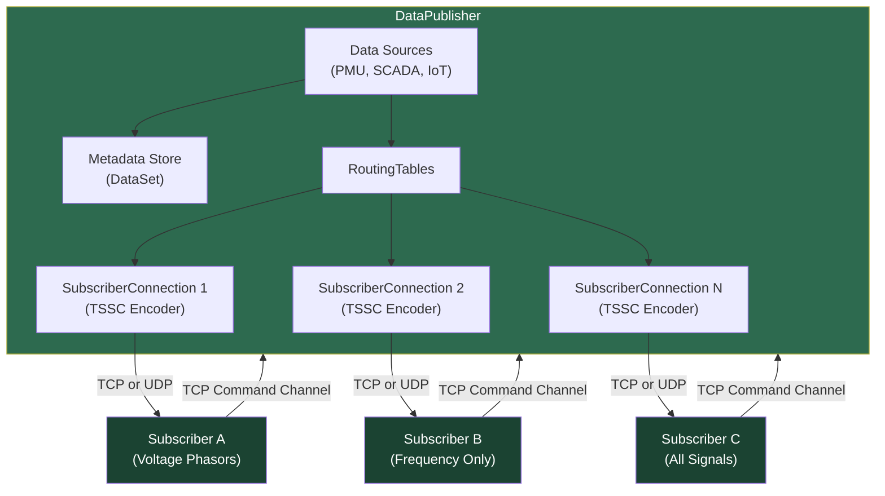
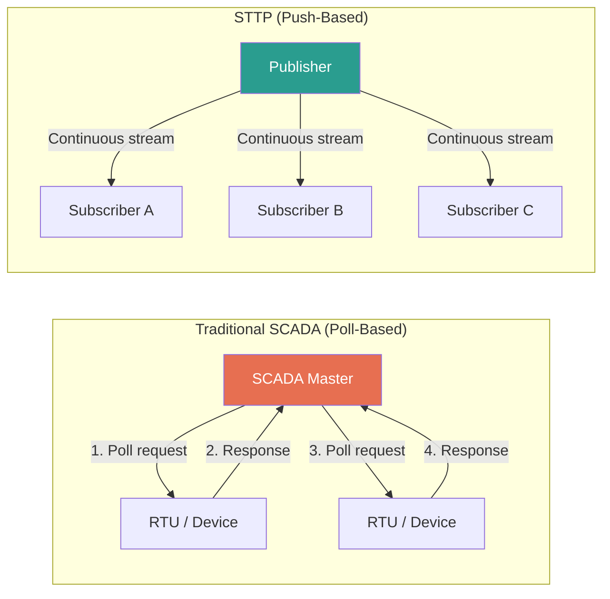
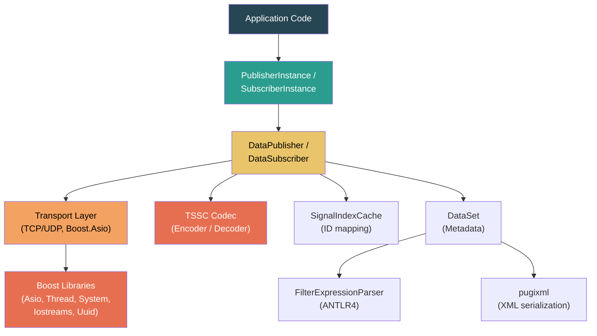
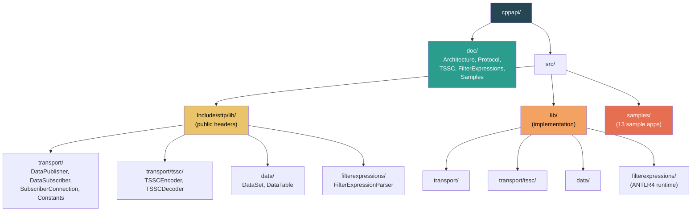
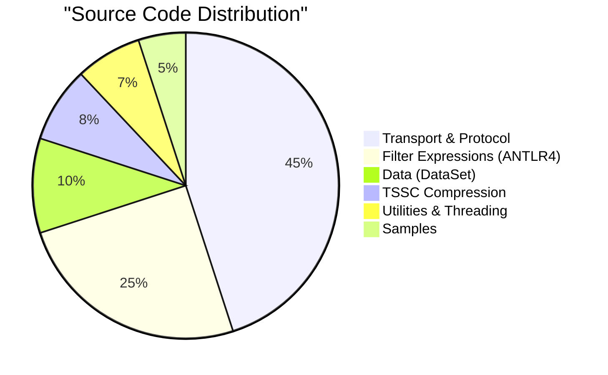

# STTP C++ API

[](https://github.com/sttp/cppapi/actions/workflows/codeql.yml)
[](https://opensource.org/licenses/MIT)
[](https://standards.ieee.org/project/2664.html)

**C++ implementation of the Streaming Telemetry Transport Protocol (STTP)** -- a high-performance, publish-subscribe protocol for real-time streaming telemetry data, standardized as [IEEE 2664-2024](https://standards.ieee.org/project/2664.html).

STTP is optimized for synchrophasor (PMU), SCADA, and IoT data streams where low latency, high throughput, and bandwidth efficiency are critical.

---

## Architecture Overview



Each subscriber specifies a **filter expression** to select exactly which signals to receive. The publisher evaluates the filter, builds a signal index cache, and streams only the requested measurements using TSSC compression.

---

## Key Features

| Feature | Description | Learn More |
|---------|-------------|------------|
| **Publisher-Subscriber Model** | Push-based one-to-many data distribution with per-subscriber signal filtering | [Architecture](doc/Architecture.md) |
| **TSSC Compression** | Time-Series Special Compression achieves 10:1+ compression with delta encoding and adaptive coding | [TSSC Deep-Dive](doc/TSSC.md) |
| **Dual TCP/UDP Channels** | TCP for reliable commands, optional UDP for low-latency data streaming | [Protocol Reference](doc/Protocol.md) |
| **Filter Expressions** | SQL-like WHERE clauses for server-side signal selection | [Filter Expressions](doc/FilterExpressions.md) |
| **Reverse Subscribe** | Subscriber listens, publisher connects -- firewall-friendly topology | [Connection Modes](doc/Architecture.md#connection-modes) |
| **Temporal Subscriptions** | Replay historical data with time-based queries and playback control | [Temporal Subscriptions](doc/Protocol.md#temporal-subscriptions) |
| **Cipher Key Rotation** | Dual-key encryption with seamless rotation, no data interruption | [Security Model](doc/Architecture.md#security-model) |
| **Auto-Reconnect** | Exponential backoff reconnection with configurable retry limits | [Auto-Reconnect](doc/Architecture.md#connection-modes) |
| **Rich Metadata** | XML-serialized DataSet with device, measurement, and phasor metadata | [Metadata Exchange](doc/Protocol.md#metadata-exchange) |
| **Quality Flags** | 32-bit measurement state flags for data quality, time quality, and alarms | [Quality Flags](doc/Architecture.md#measurement-quality-flags) |
| **Multi-Threaded** | Dedicated threads for command, data, routing, and callbacks | [Threading Model](doc/Architecture.md#threading-model) |
| **Cross-Platform** | Windows (Visual Studio 2022) and Linux/Unix (CMake + gcc 10.2+) | [Build Instructions](src/README.md) |

---

## STTP vs Traditional Protocols



| Aspect | Traditional (Poll) | STTP (Push) |
|--------|-------------------|-------------|
| **Latency** | High (poll interval) | Low (immediate push) |
| **Bandwidth** | Inefficient (full payload each poll) | Efficient (TSSC delta compression) |
| **Scalability** | O(N) polls per device | O(1) publish, fan-out to N subscribers |
| **Data Selection** | All-or-nothing | Per-subscriber filter expressions |
| **Historical Replay** | Separate historian query | Built-in temporal subscriptions |
| **Connection Resilience** | Manual reconnect | Auto-reconnect with backoff |
| **Compression** | Typically none | TSSC: 10:1+ for time-series data |
| **Security** | Varies | TLS + rotating cipher keys |

---

## Module Architecture



---

## Repository Structure



---

## Codebase Composition



---

## Quick Start

### Minimal Subscriber (High-Level API)

```cpp
#include "sttp/transport/SubscriberInstance.h"

class MySubscriber : public sttp::transport::SubscriberInstance
{
protected:
    void ReceivedNewMeasurements(const std::vector<sttp::transport::MeasurementPtr>& measurements) override
    {
        for (const auto& m : measurements)
            std::cout << m->SignalID << " = " << m->Value << std::endl;
    }

    void StatusMessage(const std::string& message) override
    {
        std::cout << message << std::endl;
    }

    void ErrorMessage(const std::string& message) override
    {
        std::cerr << message << std::endl;
    }
};

int main()
{
    MySubscriber subscriber;
    subscriber.Connect("localhost", 7165);
    subscriber.SetFilterExpression("FILTER ActiveMeasurements WHERE SignalType = 'FREQ'");
    subscriber.Subscribe();

    // Run until interrupted...
    std::string line;
    std::getline(std::cin, line);

    subscriber.Disconnect();
    return 0;
}
```

---

## Sample Applications

| Sample | Role | Description |
|--------|------|-------------|
| [SimplePublish](src/samples/SimplePublish) | Publisher | Basic measurement publishing with XML metadata |
| [SimpleSubscribe](src/samples/SimpleSubscribe) | Subscriber | Basic subscription and data reception |
| [InstancePublish](src/samples/InstancePublish) | Publisher | High-level API with virtual method overrides |
| [InstanceSubscribe](src/samples/InstanceSubscribe) | Subscriber | High-level API with virtual method overrides |
| [AdvancedPublish](src/samples/AdvancedPublish) | Publisher | Dynamic metadata, temporal subscription support |
| [AdvancedSubscribe](src/samples/AdvancedSubscribe) | Subscriber | Auto-reconnect, metadata parsing, signal display |
| [ReversePublish](src/samples/ReversePublish) | Publisher | Publisher connects to subscriber (reverse mode) |
| [ReverseSubscribe](src/samples/ReverseSubscribe) | Subscriber | Subscriber listens for publisher connections |
| [DynamicMetadataPublish](src/samples/DynamicMetadataPublish) | Publisher | Runtime metadata creation and updates |
| [LatencyTest](src/samples/LatencyTest) | Subscriber | End-to-end latency measurement |
| [AverageFrequencyCalculator](src/samples/AverageFrequencyCalculator) | Subscriber | Rolling frequency average calculation |
| [FilterExpressionTests](src/samples/FilterExpressionTests) | Utility | Filter expression parser test harness |
| [InteropTest](src/samples/InteropTest) | Subscriber | Cross-platform interoperability testing |

See the [Sample Applications Guide](doc/Samples.md) for detailed walkthroughs.

---

## Documentation

| Document | Description |
|----------|-------------|
| [Architecture](doc/Architecture.md) | System architecture, class hierarchy, threading model, connection modes |
| [TSSC Compression](doc/TSSC.md) | Deep-dive into the Time-Series Special Compression algorithm |
| [Protocol Reference](doc/Protocol.md) | Wire protocol, commands, responses, packet formats |
| [Filter Expressions](doc/FilterExpressions.md) | SQL-like filter expression language reference |
| [Sample Applications](doc/Samples.md) | Guide to all 13 sample applications |
| [Data Sets](src/lib/data/README.md) | DataSet, DataTable, DataColumn, DataRow documentation |
| [Build Instructions](src/README.md) | Windows and Linux build guides |
| [Full STTP Documentation](https://sttp.info/) | Complete STTP specification and reference |

---

## Building

Requires [Boost](https://www.boost.org/) C++ Libraries (v1.80.0 recommended) and a C++20 compiler.

**Linux (Quick Start):**
```bash
cmake .
make -j6 samples
```

**Windows:** Open the Visual Studio 2022 solution in `src/`.

See [Build Instructions](src/README.md) for detailed setup including Boost installation.

---

## License

[MIT License](LICENSE) -- Copyright (c) 2020 Streaming Telemetry Transport Protocol

---

## Security

See [SECURITY.md](SECURITY.md) for vulnerability reporting procedures.
