# STTP C++ API Architecture

> System architecture reference for the Streaming Telemetry Transport Protocol (STTP) C++ implementation, IEEE 2664-2024.

---

## Table of Contents

- [System Overview](#system-overview)
- [Publisher-Subscriber Model](#publisher-subscriber-model)
- [Class Hierarchy](#class-hierarchy)
- [Connection Lifecycle](#connection-lifecycle)
- [Connection Modes](#connection-modes)
- [Signal Routing](#signal-routing)
- [Signal Index Cache](#signal-index-cache)
- [Threading Model](#threading-model)
- [Security Model](#security-model)
- [Measurement Quality Flags](#measurement-quality-flags)
- [Design Patterns](#design-patterns)

---

## System Overview

The STTP C++ API implements a high-performance **publisher-subscriber** messaging system optimized for real-time streaming telemetry. The architecture separates **control** (TCP) from **data** (TCP or UDP) using a dual-channel design.

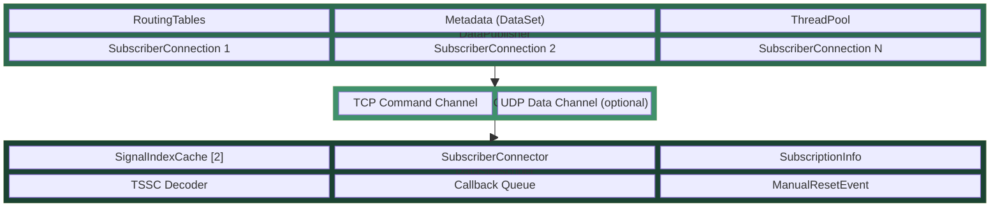

### Module Dependency Graph

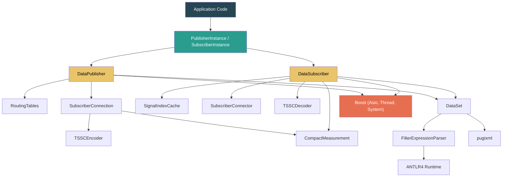

---

## Publisher-Subscriber Model

STTP uses a **push-based** model where the publisher actively streams measurements to all subscribed clients. Each subscriber specifies a **filter expression** to select which signals it wants to receive.

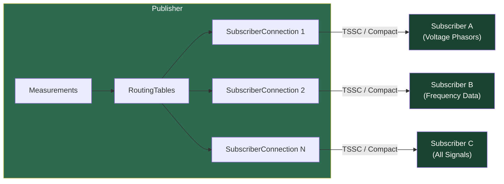

### Data Flow Pipeline

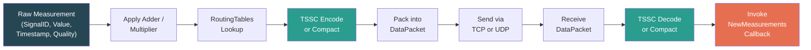

---

## Class Hierarchy

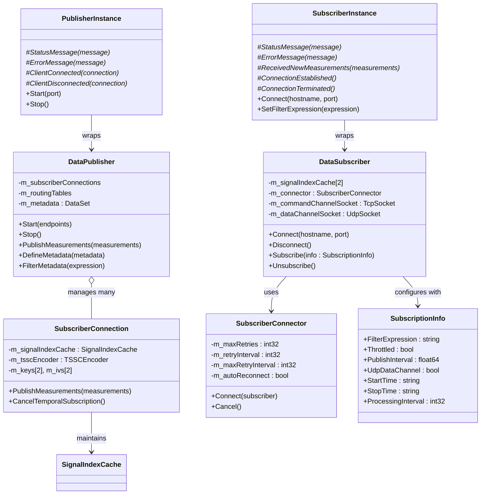

---

## Connection Lifecycle

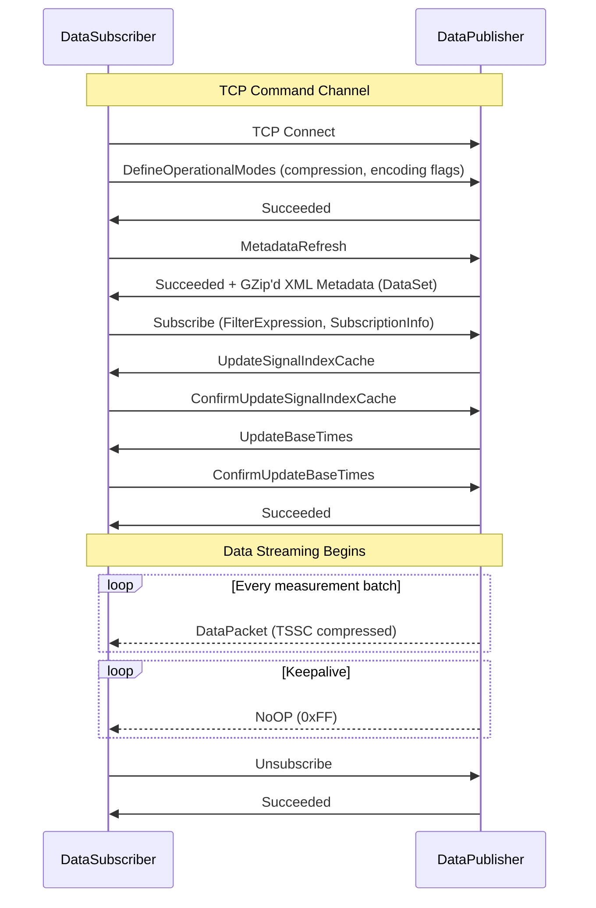

---

## Connection Modes

STTP supports three connection patterns to handle different network topologies and firewall configurations.

### Normal Mode (Subscriber Connects to Publisher)

The standard mode where the publisher listens and the subscriber initiates the connection. Used when the publisher is accessible from the subscriber's network.

### Reverse Mode (Publisher Connects to Subscriber)

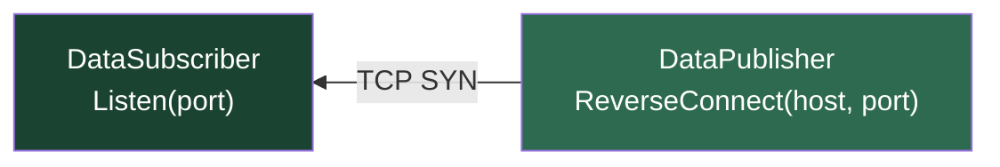

In reverse mode, the **subscriber listens** on a port and the **publisher initiates** the TCP connection. This is critical for scenarios where:
- The subscriber is behind a firewall that blocks inbound connections
- The publisher is in a DMZ or external network
- Network policy requires data to be "pushed" from a trusted zone

The protocol flow after connection is identical -- only the TCP initiation direction is reversed.

### Auto-Reconnect State Machine

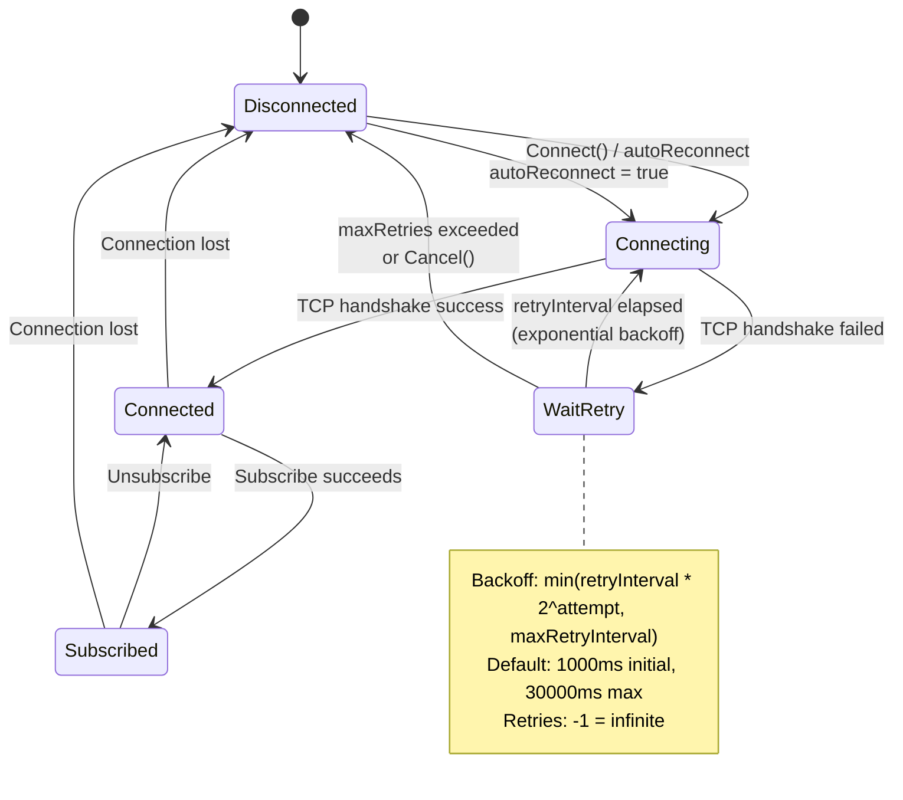

**SubscriberConnector** manages reconnection with:

| Parameter | Default | Description |
|-----------|---------|-------------|
| `MaxRetries` | `-1` (infinite) | Total retry attempts before giving up |
| `RetryInterval` | `1000` ms | Initial delay between retry attempts |
| `MaxRetryInterval` | `30000` ms | Maximum backoff cap |
| `AutoReconnect` | `true` | Enable automatic reconnection |

---

## Signal Routing

The `RoutingTables` class manages signal-to-subscriber mappings, enabling efficient fan-out of measurements.

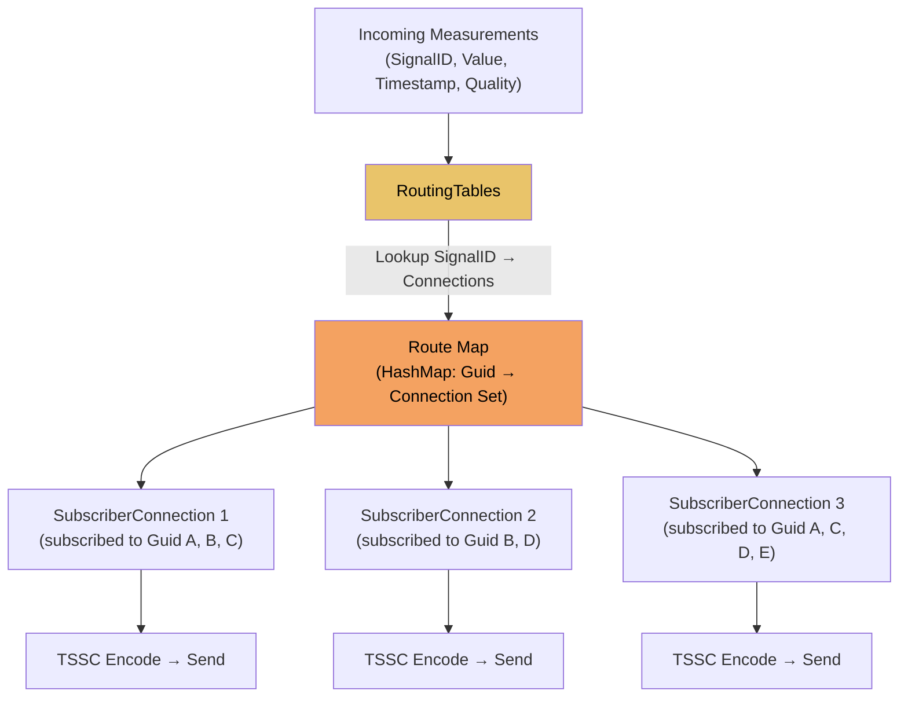

Routing operations are **queued** via `ThreadSafeQueue<RoutingTableOperation>` to ensure thread safety. Routes are updated when subscribers change their filter expressions or disconnect.

---

## Signal Index Cache

The `SignalIndexCache` provides compact wire representation of measurements by mapping 128-bit GUIDs to small 16-bit runtime indices.

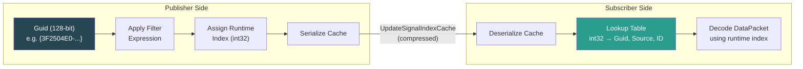

### Double-Buffered Cache

The signal index cache uses **double-buffering** (`m_signalIndexCache[2]`) with the `CacheIndex` flag in `DataPacketFlags` to indicate which cache is active. This enables zero-downtime cache updates:

1. Publisher builds new cache in the inactive slot
2. Sends `UpdateSignalIndexCache` to subscriber
3. Subscriber confirms with `ConfirmUpdateSignalIndexCache`
4. Publisher toggles `CacheIndex` flag in subsequent `DataPacket` headers
5. Both sides now use the new cache while the old one can be recycled

---

## Threading Model

The STTP implementation uses a multi-threaded architecture to maximize throughput and responsiveness.

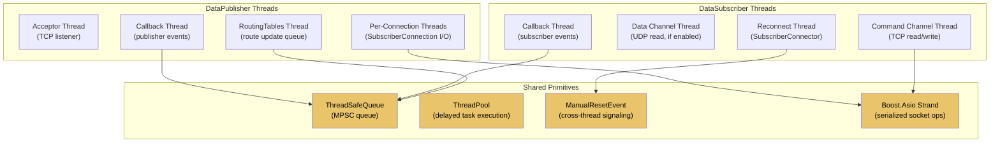

### Concurrency Primitives

| Primitive | Type | Purpose |
|-----------|------|---------|
| `ThreadPool` | Task scheduler | Delayed task execution using timers |
| `ThreadSafeQueue<T>` | MPSC queue | Multiple-producer, single-consumer callback dispatch |
| `ManualResetEvent` | Event signal | Cross-thread wait/notify synchronization |
| `Mutex` / `SharedMutex` | Lock | Exclusive / reader-writer locking |
| `ScopeLock` / `WriterLock` / `ReaderLock` | RAII guard | Scoped lock acquisition |
| `Strand` | Boost.Asio | Serialized async operations on sockets |
| `atomic<bool>` | Atomic flag | Lock-free cancellation / state flags |

### Callback Dispatch Pattern

All user callbacks (status messages, new measurements, connection events) are dispatched through a `ThreadSafeQueue<CallbackDispatcher>` to ensure:
- Single-threaded callback execution (no concurrent callback invocations)
- Decoupling of I/O threads from application logic
- Predictable ordering of events

---

## Security Model

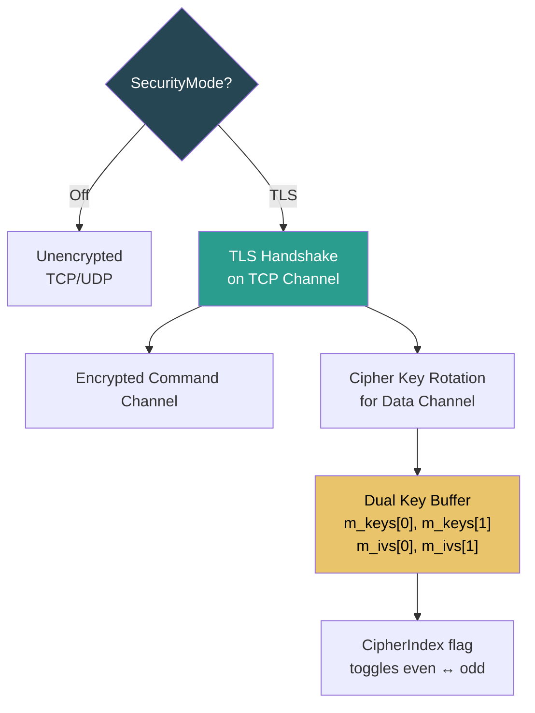

### Cipher Key Rotation Sequence

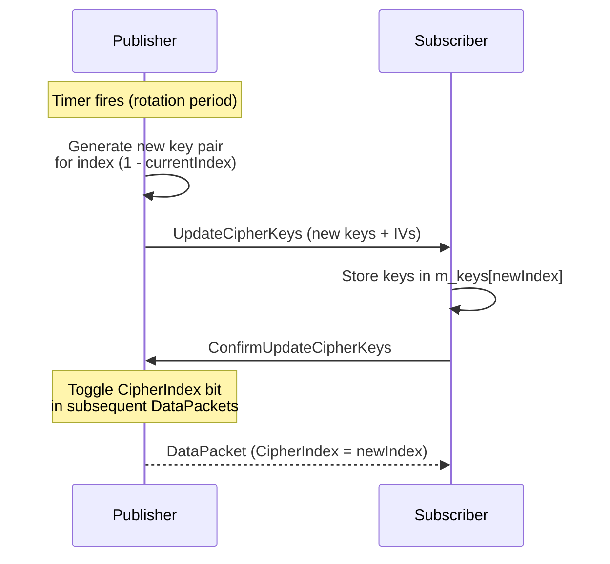

---

## Measurement Quality Flags

Each measurement carries a 32-bit `MeasurementStateFlags` bitmask that provides detailed quality information.

| Bit | Hex | Flag | Category |
|-----|-----|------|----------|
| 0 | `0x0001` | `BadData` | Data Quality |
| 1 | `0x0002` | `SuspectData` | Data Quality |
| 2 | `0x0004` | `OverRangeError` | Data Quality |
| 3 | `0x0008` | `UnderRangeError` | Data Quality |
| 4 | `0x0010` | `AlarmHigh` | Alarm |
| 5 | `0x0020` | `AlarmLow` | Alarm |
| 6 | `0x0040` | `WarningHigh` | Alarm |
| 7 | `0x0080` | `WarningLow` | Alarm |
| 8 | `0x0100` | `FlatlineAlarm` | Alarm |
| 9 | `0x0200` | `ComparisonAlarm` | Alarm |
| 10 | `0x0400` | `ROCAlarm` | Alarm |
| 11 | `0x0800` | `ReceivedAsBad` | Data Quality |
| 12 | `0x1000` | `CalculatedValue` | Calculation |
| 13 | `0x2000` | `CalculationError` | Calculation |
| 14 | `0x4000` | `CalculationWarning` | Calculation |
| 16 | `0x10000` | `BadTime` | Time Quality |
| 17 | `0x20000` | `SuspectTime` | Time Quality |
| 18 | `0x40000` | `LateTimeAlarm` | Time Quality |
| 19 | `0x80000` | `FutureTimeAlarm` | Time Quality |
| 20 | `0x100000` | `UpSampled` | Sampling |
| 21 | `0x200000` | `DownSampled` | Sampling |
| 22 | `0x400000` | `DiscardedValue` | Sampling |
| 24-28 | `0x1000000`-`0x10000000` | `UserDefinedFlag1-5` | User Defined |
| 29 | `0x20000000` | `SystemError` | System |
| 30 | `0x40000000` | `SystemWarning` | System |
| 31 | `0x80000000` | `MeasurementError` | System |

A value of `0x0` means `Normal` -- the measurement is good with no flags set.

---

## Design Patterns

| Pattern | Where Used | Purpose |
|---------|-----------|---------|
| **Observer** | Callback system (`MessageCallback`, `NewMeasurementsCallback`) | Async event notification to application code |
| **Double Buffering** | `SignalIndexCache[2]`, cipher keys `m_keys[2]` | Zero-downtime updates to shared state |
| **Producer-Consumer** | `ThreadSafeQueue<CallbackDispatcher>` | Decouple I/O threads from callback execution |
| **Strategy** | Compression mode (TSSC / Compact / None) | Switchable encoding algorithms |
| **Command** | `ServerCommand` / `ServerResponse` protocol codes | Extensible request-response protocol |
| **Template Method** | `PublisherInstance` / `SubscriberInstance` virtual methods | Simplified API via subclassing |
| **RAII** | `ScopeLock`, `WriterLock`, `ReaderLock` | Automatic resource cleanup |
| **Adapter** | `CompactMeasurement` encoder/decoder | Translates between measurement types and wire format |
| **Factory** | `NewSharedPtr<T>()` helper | Consistent shared pointer creation |

---

*See also: [Protocol Reference](Protocol.md) | [TSSC Compression](TSSC.md) | [Filter Expressions](FilterExpressions.md) | [Sample Applications](Samples.md)*
