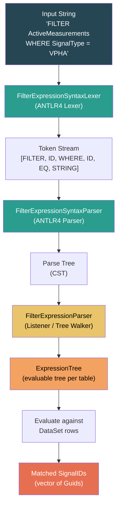
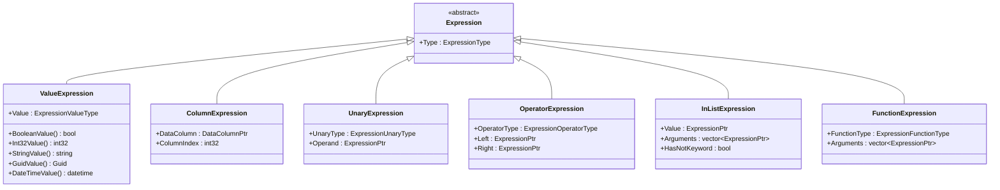
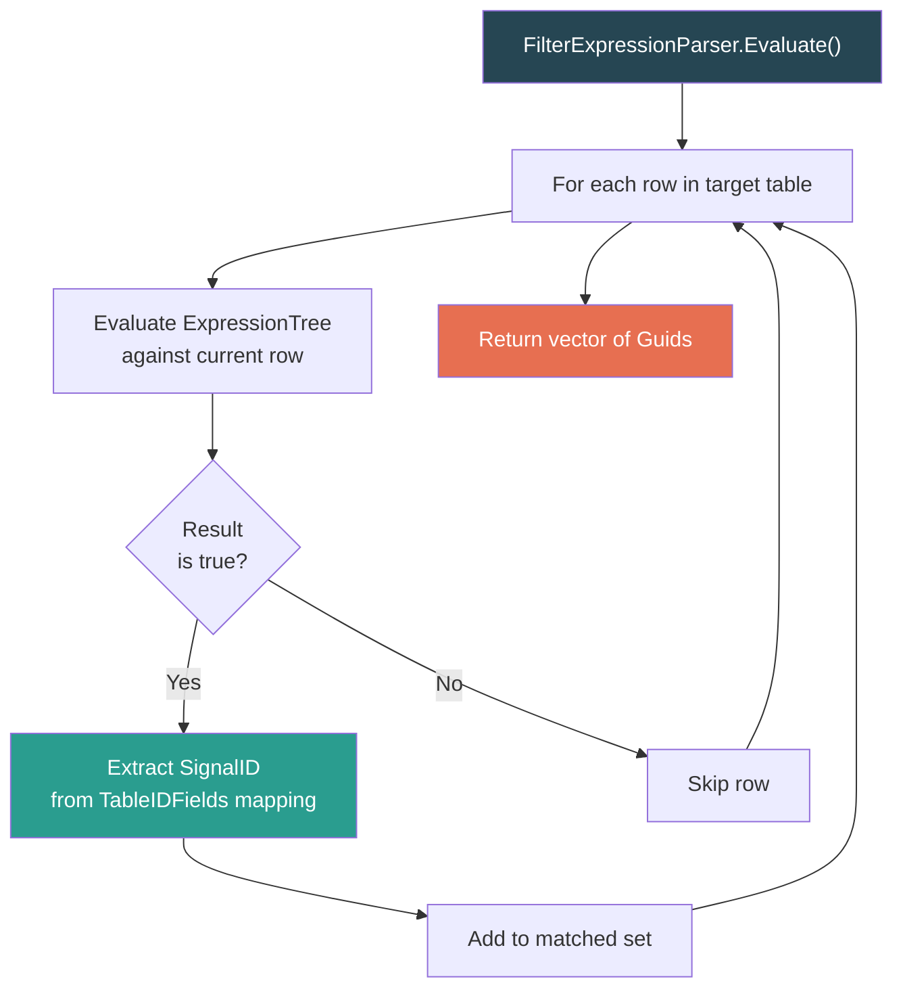
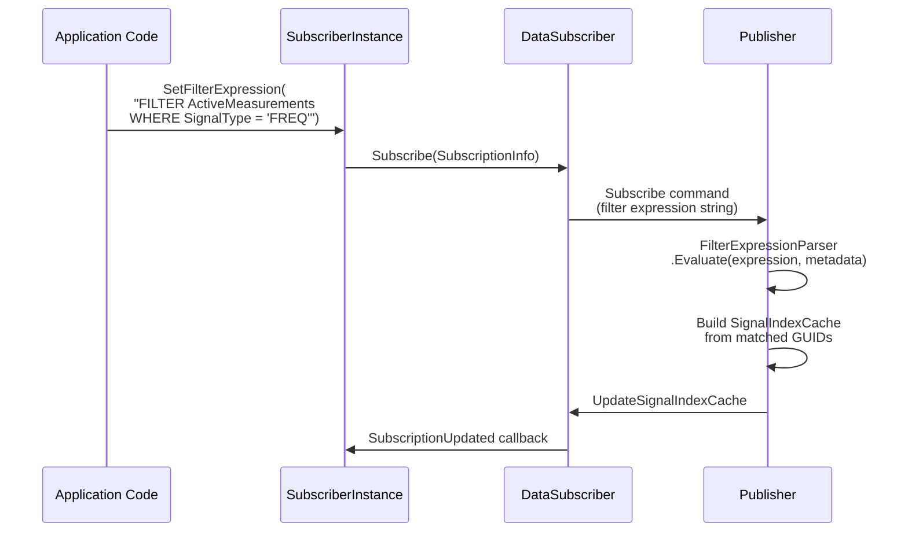

# STTP Filter Expressions

> SQL-like filter expression language for signal selection and data querying in STTP.

---

## Table of Contents

- [Overview](#overview)
- [Expression Syntax](#expression-syntax)
- [Parser Architecture](#parser-architecture)
- [Expression Tree](#expression-tree)
- [Operators](#operators)
- [Value Types](#value-types)
- [Type Coercion](#type-coercion)
- [Functions](#functions)
- [Usage in STTP](#usage-in-sttp)
- [Examples](#examples)

---

## Overview

STTP filter expressions provide a powerful, SQL-like language for selecting measurements at subscription time. Rather than subscribing to all available signals, a subscriber can use a filter expression to precisely specify which signals it wants based on metadata properties.

Filter expressions support three input formats:

| Format | Example | Description |
|--------|---------|-------------|
| **FILTER clause** | `FILTER ActiveMeasurements WHERE SignalType LIKE '%PHA'` | SQL-like query against metadata tables |
| **GUID list** | `{3F2504E0-4F89-11D3-9A0C-0305E82C3301}` | Direct list of signal IDs |
| **Measurement key list** | `PPA:1;PPA:2;PPA:3` | Human-readable Source:ID pairs |

The FILTER clause is the most powerful, allowing complex conditions, boolean logic, and function calls.

---

## Expression Syntax

### FILTER Clause

```
FILTER <TableName> WHERE <Condition> [ORDER BY <Column> [ASC|DESC]] [TOP <N>]
```

The condition supports standard SQL operators and STTP-specific functions:

```sql
-- Select all voltage phasor angles
FILTER ActiveMeasurements WHERE SignalType = 'VPHA'

-- Select measurements from a specific device
FILTER ActiveMeasurements WHERE Device = 'SHELBY' AND Enabled = 1

-- Select using pattern matching
FILTER ActiveMeasurements WHERE PointTag LIKE '%:FREQ'

-- Select with multiple conditions
FILTER ActiveMeasurements WHERE SignalType IN ('VPHA','VPHM') AND Device LIKE 'PMU%'

-- Combine with ordering and limiting
FILTER ActiveMeasurements WHERE SignalType = 'FREQ' ORDER BY PointTag TOP 10
```

### Multiple Expressions

Expressions can be combined with semicolons to select signals from different criteria:

```
FILTER ActiveMeasurements WHERE Device = 'PMU1';
FILTER ActiveMeasurements WHERE Device = 'PMU2';
{3F2504E0-4F89-11D3-9A0C-0305E82C3301}
```

---

## Parser Architecture

The filter expression parser uses ANTLR4 to transform expression strings into evaluable expression trees.



### Source Files

| File | Purpose |
|------|---------|
| `FilterExpressionSyntaxLexer.h/cpp` | ANTLR4-generated lexer (tokenization) |
| `FilterExpressionSyntaxParser.h/cpp` | ANTLR4-generated parser (syntax analysis) |
| `FilterExpressionParser.h/cpp` | STTP tree walker (builds ExpressionTree) |
| `ExpressionTree.h/cpp` | Expression evaluation engine |

---

## Expression Tree

The parsed expression is represented as a tree of typed nodes. Each node evaluates to a value that can be compared, combined, or tested.



### Evaluation Flow



---

## Operators

### Comparison Operators

| Operator | SQL Syntax | Description |
|----------|-----------|-------------|
| Equal | `=` | Exact match |
| Not Equal | `<>` or `!=` | Not equal |
| Less Than | `<` | Less than |
| Greater Than | `>` | Greater than |
| Less or Equal | `<=` | Less than or equal |
| Greater or Equal | `>=` | Greater than or equal |
| Like | `LIKE` | Pattern match (`%` = any chars, `_` = one char) |
| Not Like | `NOT LIKE` | Inverse pattern match |
| Is Null | `IS NULL` | Value is null |
| Is Not Null | `IS NOT NULL` | Value is not null |

### Logical Operators

| Operator | Description |
|----------|-------------|
| `AND` | Both conditions must be true |
| `OR` | Either condition must be true |
| `NOT` | Inverts the condition |

### Set Operators

| Operator | Example | Description |
|----------|---------|-------------|
| `IN` | `SignalType IN ('FREQ','VPHA')` | Value is in the list |
| `NOT IN` | `Device NOT IN ('PMU1','PMU2')` | Value is not in the list |

### Arithmetic Operators

| Operator | Description |
|----------|-------------|
| `+` | Addition |
| `-` | Subtraction |
| `*` | Multiplication |
| `/` | Division |
| `%` | Modulo |

---

## Value Types

The expression engine supports these value types, corresponding to the `ExpressionValueType` enum:

| Type | Description | Example Literal |
|------|-------------|-----------------|
| `Boolean` | True/false | `true`, `false`, `1`, `0` |
| `Int32` | 32-bit integer | `42`, `-7` |
| `Int64` | 64-bit integer | `9999999999` |
| `Decimal` | High-precision decimal | `3.14159265358979` |
| `Double` | 64-bit floating point | `120.5` |
| `String` | Text | `'VPHA'`, `'PMU%'` |
| `Guid` | 128-bit identifier | `{3F2504E0-...}` |
| `DateTime` | Date and time | `'2024-01-01'`, `#2024-01-01#` |

---

## Type Coercion

When operands have different types, the expression engine automatically promotes values to a common type:


Promotion is always left-to-right (widening), never narrowing. For example:
- `Int32 + Int64` → promotes to `Int64`
- `Int32 + Double` → promotes to `Double`
- `String = Guid` → converts Guid to string for comparison

---

## Functions

Filter expressions support a rich set of built-in functions:

### String Functions

| Function | Description | Example |
|----------|-------------|---------|
| `Len(s)` | String length | `Len(PointTag) > 10` |
| `SubStr(s, start, len)` | Substring extraction | `SubStr(Device, 0, 3) = 'PMU'` |
| `Upper(s)` | Convert to uppercase | `Upper(SignalType) = 'FREQ'` |
| `Lower(s)` | Convert to lowercase | `Lower(Device)` |
| `Trim(s)` | Remove whitespace | `Trim(Description)` |
| `LTrim(s)` / `RTrim(s)` | Left/right trim | |
| `Replace(s, old, new)` | String replacement | `Replace(PointTag, ':', '_')` |
| `IndexOf(s, search)` | Find substring position | `IndexOf(PointTag, 'FREQ') >= 0` |
| `Contains(s, search)` | Contains substring | `Contains(Description, 'voltage')` |
| `StartsWith(s, prefix)` | Starts with prefix | `StartsWith(Device, 'PMU')` |
| `EndsWith(s, suffix)` | Ends with suffix | `EndsWith(PointTag, ':FREQ')` |
| `RegExMatch(s, pattern)` | Regular expression match | `RegExMatch(PointTag, '^PMU\d+')` |
| `RegExVal(s, pattern)` | Extract regex match | |

### Type Conversion Functions

| Function | Description |
|----------|-------------|
| `Convert(value, type)` | Convert between types |
| `ToString(value)` | Convert to string |
| `ToGuid(s)` | Parse string as GUID |
| `ToDateTime(s)` | Parse string as DateTime |

### Math Functions

| Function | Description |
|----------|-------------|
| `Abs(x)` | Absolute value |
| `Ceiling(x)` | Round up |
| `Floor(x)` | Round down |
| `Round(x)` | Round to nearest |
| `Sqrt(x)` | Square root |
| `Power(x, y)` | x raised to power y |

### Aggregate & Utility Functions

| Function | Description |
|----------|-------------|
| `IsNull(value, default)` | Coalesce null values |
| `IIf(condition, true, false)` | Conditional expression |
| `Now()` | Current date/time |
| `UtcNow()` | Current UTC date/time |

---

## Usage in STTP

Filter expressions are used at several points in the STTP protocol:



### Where Filters Are Evaluated

| Location | Purpose |
|----------|---------|
| **Publisher** (on `Subscribe`) | Select which signals to stream to this subscriber |
| **Publisher** (`FilterMetadata()`) | Pre-filter metadata before sending to subscriber |
| **Application** (direct use) | Query local DataSet for signal discovery |

---

## Examples

### Select All Frequency Measurements

```sql
FILTER ActiveMeasurements WHERE SignalType = 'FREQ'
```

### Select Voltage Phasors from Specific Devices

```sql
FILTER ActiveMeasurements WHERE SignalType IN ('VPHA', 'VPHM') AND Device LIKE 'SHELBY%'
```

### Select by Point Tag Pattern

```sql
FILTER ActiveMeasurements WHERE PointTag LIKE '%:FREQ' OR PointTag LIKE '%:VPHA'
```

### Select Enabled Measurements with Description

```sql
FILTER ActiveMeasurements WHERE Enabled = 1 AND Description IS NOT NULL
```

### Direct GUID Selection

```
{3F2504E0-4F89-11D3-9A0C-0305E82C3301};
{7C9D3E8A-2B5F-4A1D-8E6C-9F0A1B2C3D4E}
```

### Measurement Key Selection

```
PPA:1;PPA:2;PPA:3;PPA:4;PPA:5
```

### Combined Selection

```
FILTER ActiveMeasurements WHERE Device = 'SHELBY';
PPA:100;PPA:101;
{3F2504E0-4F89-11D3-9A0C-0305E82C3301}
```

---

*See also: [Architecture](Architecture.md) | [Protocol Reference](Protocol.md) | [TSSC Compression](TSSC.md) | [Data Sets](../src/lib/data/README.md)*
