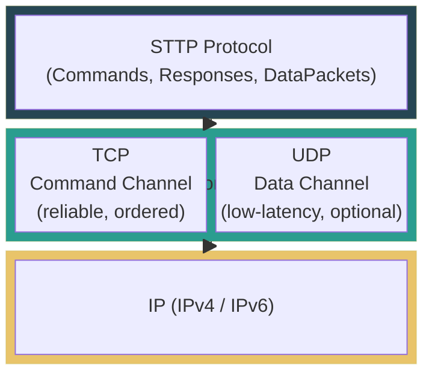
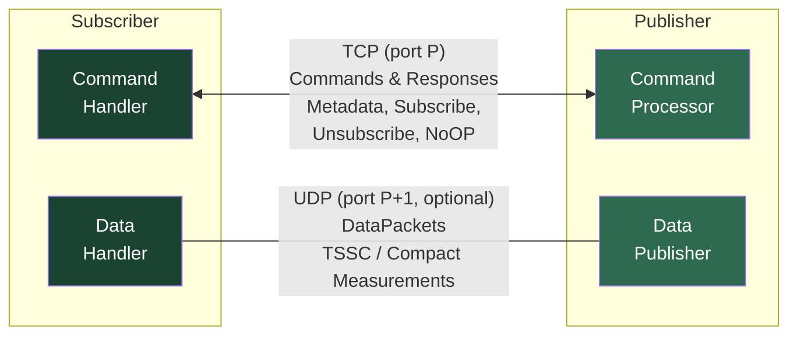
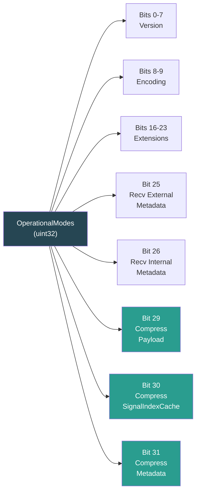
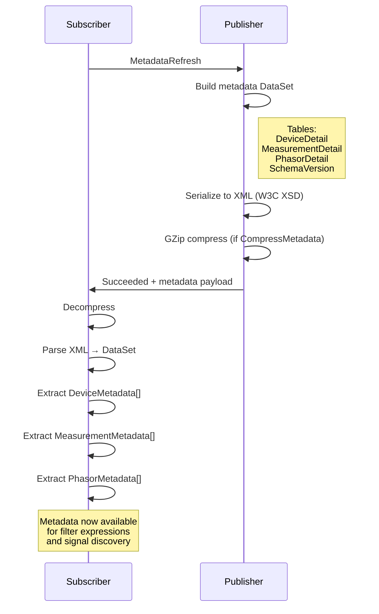
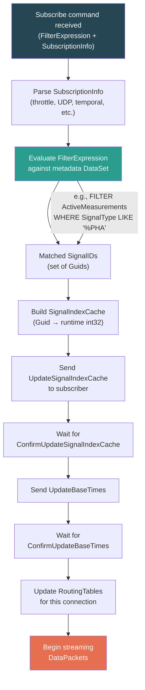
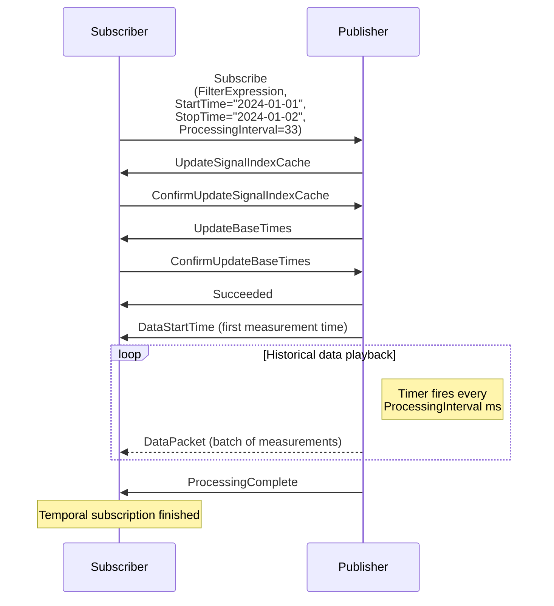
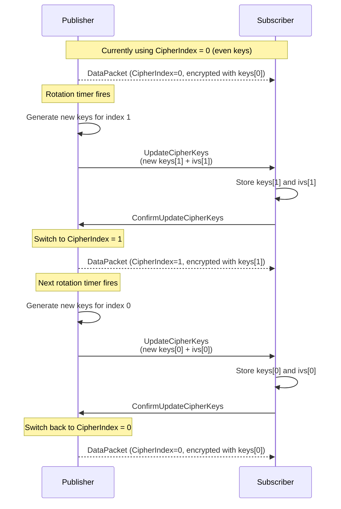
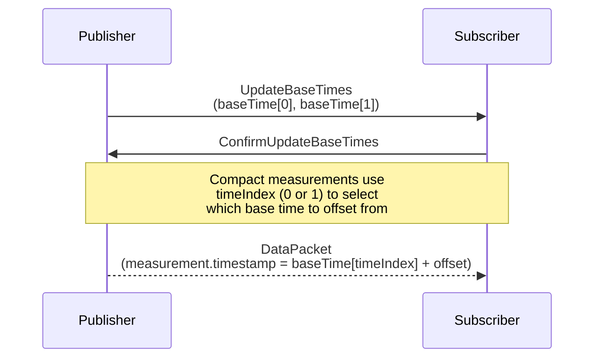
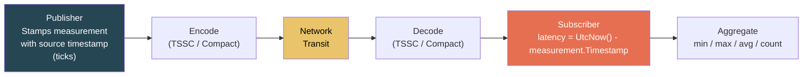

# STTP Protocol Reference

> Wire protocol specification for the Streaming Telemetry Transport Protocol (STTP), IEEE 2664-2024.

---

## Table of Contents

- [Protocol Overview](#protocol-overview)
- [Dual-Channel Architecture](#dual-channel-architecture)
- [Packet Structure](#packet-structure)
- [Server Commands](#server-commands)
- [Server Responses](#server-responses)
- [Operational Modes](#operational-modes)
- [Data Packet Flags](#data-packet-flags)
- [Connection Sequence](#connection-sequence)
- [Metadata Exchange](#metadata-exchange)
- [Subscription Flow](#subscription-flow)
- [Temporal Subscriptions](#temporal-subscriptions)
- [Cipher Key Rotation](#cipher-key-rotation)
- [Base Time Offset Updates](#base-time-offset-updates)
- [Latency Measurement](#latency-measurement)

---

## Protocol Overview

STTP is a binary protocol that operates over TCP and optionally UDP. It uses a **dual-channel** design: a reliable TCP channel for commands/responses, and an optional UDP channel for high-throughput, low-latency measurement streaming.



---

## Dual-Channel Architecture



| Channel | Transport | Purpose | Reliability |
|---------|-----------|---------|-------------|
| **Command** | TCP | Control messages, metadata exchange, subscription management | Guaranteed delivery & ordering |
| **Data** | UDP *(optional)* | Measurement streaming (DataPacket) | Best-effort, low-latency |

When UDP is not enabled (default), all data flows over the TCP command channel.

---

## Packet Structure

### TCP Payload Header (4 bytes)

```
┌─────────────────────────────────────────┐
│  Payload Size (int32, little-endian)    │
├─────────────────────────────────────────┤
│  Response Code (uint8)                  │
│  Command Code (uint8)                   │
│  Data Length (int32, little-endian)      │
│  Data (variable)                        │
└─────────────────────────────────────────┘
```

| Field | Size | Description |
|-------|------|-------------|
| Payload Size | 4 bytes | Total size of the following payload (`PayloadHeaderSize = 4`) |
| Response Code | 1 byte | `ServerResponse` enum value |
| Command Code | 1 byte | Original `ServerCommand` that triggered this response |
| Data Length | 4 bytes | Length of the data segment |
| Data | Variable | Response-specific payload |

Response header size is 6 bytes (`ResponseHeaderSize = 6`): response code (1) + command code (1) + data length (4).

### Data Packet Format

```
┌─────────────────────────────────────┐
│  DataPacketFlags (uint8)            │
├─────────────────────────────────────┤
│  Frame-Level Timestamp (optional)   │
│  (int64, if not compact)            │
├─────────────────────────────────────┤
│  Measurement Payload                │
│  (Compact or TSSC encoded)          │
└─────────────────────────────────────┘
```

Maximum packet size: **32,768 bytes** (`MaxPacketSize`).

---

## Server Commands

Commands are sent by the **DataSubscriber** to the **DataPublisher** over the TCP command channel.

| Code | Name | Description |
|------|------|-------------|
| `0x00` | `Connect` | Connection handling (used internally for connection refused) |
| `0x01` | `MetadataRefresh` | Request updated metadata from publisher |
| `0x02` | `Subscribe` | Subscribe to streaming data with filter expression |
| `0x03` | `Unsubscribe` | Cancel current subscription |
| `0x04` | `RotateCipherKeys` | Request new cipher keys for data encryption |
| `0x05` | `UpdateProcessingInterval` | Change the server-side processing interval |
| `0x06` | `DefineOperationalModes` | Set operational modes (compression, encoding, etc.) |
| `0x07` | `ConfirmNotification` | Acknowledge receipt of a notification |
| `0x08` | `ConfirmBufferBlock` | Acknowledge receipt of a buffer block |
| `0x09` | `ConfirmUpdateBaseTimes` | Acknowledge receipt of base time offsets |
| `0x0A` | `ConfirmUpdateSignalIndexCache` | Acknowledge receipt of signal index cache |
| `0x0B` | `ConfirmUpdateCipherKeys` | Acknowledge receipt of cipher keys |
| `0x0C` | `GetPrimaryMetadataSchema` | Request primary metadata schema definition |
| `0x0D` | `GetSignalSelectionSchema` | Request signal selection schema definition |
| `0xD0`-`0xDF` | `UserCommand00`-`UserCommand15` | 16 user-defined command codes for custom extensions |

---

## Server Responses

Responses are sent by the **DataPublisher** to the **DataSubscriber**. Solicited responses reply to a specific command; unsolicited responses are sent proactively.

| Code | Name | Type | Description |
|------|------|------|-------------|
| `0x80` | `Succeeded` | Solicited | Command succeeded, success message + data follows |
| `0x81` | `Failed` | Solicited | Command failed, error message follows |
| `0x82` | `DataPacket` | Unsolicited | Streaming measurement data |
| `0x83` | `UpdateSignalIndexCache` | Unsolicited | New signal index cache for runtime ID mapping |
| `0x84` | `UpdateBaseTimes` | Unsolicited | Updated base-timestamp offsets |
| `0x85` | `UpdateCipherKeys` | Solicited/Unsolicited | New cipher keys for data encryption |
| `0x86` | `DataStartTime` | Unsolicited | Start time of data being published |
| `0x87` | `ProcessingComplete` | Unsolicited | Temporal subscription has finished processing |
| `0x88` | `BufferBlock` | Unsolicited | Raw buffer block data |
| `0x89` | `Notify` | Unsolicited | Notification message to the subscriber |
| `0x8A` | `ConfigurationChanged` | Unsolicited | Publisher configuration has changed |
| `0xE0`-`0xEF` | `UserResponse00`-`UserResponse15` | User-defined | 16 user-defined response codes |
| `0xFF` | `NoOP` | Unsolicited | Keep-alive ping to test connectivity |

---

## Operational Modes

Sent by the subscriber via `DefineOperationalModes` immediately after TCP connection. These bit flags negotiate protocol behavior.

| Bit(s) | Mask | Name | Description |
|--------|------|------|-------------|
| 0-7 | `0x000000FF` | `VersionMask` | Protocol version number |
| 0-4 | `0x0000001F` | `PreStandardVersionMask` | Version for pre-IEEE implementations |
| 8-9 | `0x00000300` | `EncodingMask` | String encoding (currently UTF-8 only) |
| 16-23 | `0x00FF0000` | `ImplementationSpecificExtensionMask` | Custom extensions (0 = none) |
| 25 | `0x02000000` | `ReceiveExternalMetadata` | Include external measurements in metadata |
| 26 | `0x04000000` | `ReceiveInternalMetadata` | Include internal measurements in metadata |
| 29 | `0x20000000` | `CompressPayloadData` | Compress measurement payload (TSSC) |
| 30 | `0x40000000` | `CompressSignalIndexCache` | GZip-compress signal index cache |
| 31 | `0x80000000` | `CompressMetadata` | GZip-compress metadata XML |



---

## Data Packet Flags

Each `DataPacket` (response code `0x82`) begins with a flag byte:

| Bit | Mask | Name | Description |
|-----|------|------|-------------|
| 0 | `0x01` | `Synchronized` | *(Obsolete)* Data is time-synchronized |
| 1 | `0x02` | `Compact` | Compact format (vs. full fidelity) |
| 2 | `0x04` | `CipherIndex` | Which cipher key set: 0=even, 1=odd |
| 3 | `0x08` | `Compressed` | Payload uses TSSC compression |
| 4 | `0x10` | `CacheIndex` | Which signal index cache: 0=even, 1=odd |

Common flag combinations:

| Flags | Hex | Meaning |
|-------|-----|---------|
| `Compact + Compressed` | `0x0A` | TSSC-compressed compact measurements (default) |
| `Compact` | `0x02` | Compact measurements without TSSC |
| `NoFlags` | `0x00` | Full-fidelity measurements |

---

## Connection Sequence

The complete connection lifecycle from TCP handshake to data streaming:

```mermaid
sequenceDiagram
    participant S as Subscriber
    participant P as Publisher

    rect rgb(38, 70, 83)
    Note over S,P: Phase 1 — Connection Setup
    S->>P: TCP Connect (port)
    P->>P: Create SubscriberConnection
    S->>P: DefineOperationalModes<br/>(version, compression flags, encoding)
    P->>S: Succeeded (modes accepted)
    end

    rect rgb(42, 157, 143)
    Note over S,P: Phase 2 — Metadata Exchange
    S->>P: MetadataRefresh
    P->>P: Serialize metadata DataSet → XML → GZip
    P->>S: Succeeded + compressed metadata
    S->>S: Decompress → Parse XML → Build DataSet
    end

    rect rgb(233, 196, 106)
    Note over S,P: Phase 3 — Subscription
    S->>P: Subscribe (FilterExpression, SubscriptionInfo)
    P->>P: Evaluate filter → Build SignalIndexCache
    P->>S: UpdateSignalIndexCache (compressed)
    S->>P: ConfirmUpdateSignalIndexCache
    P->>S: UpdateBaseTimes (2 base offsets)
    S->>P: ConfirmUpdateBaseTimes
    P->>S: Succeeded (subscription active)
    end

    rect rgb(231, 111, 81)
    Note over S,P: Phase 4 — Data Streaming
    loop Continuous
        P-->>S: DataPacket (TSSC compressed measurements)
    end
    loop Periodic
        P-->>S: NoOP (keepalive)
    end
    end
```



---

## Metadata Exchange

STTP uses a rich metadata model based on XML-serialized `DataSet` objects. The publisher defines metadata tables describing available devices, measurements, and phasors.



### Metadata Tables

| Table | Key Fields | Description |
|-------|-----------|-------------|
| **DeviceDetail** | UniqueID, Acronym, Name, FramesPerSecond, Company, Protocol | Physical device information |
| **MeasurementDetail** | SignalID, PointTag, SignalReference, Description, Enabled | Per-signal metadata |
| **PhasorDetail** | DeviceAcronym, Label, Type (V/I), Phase (+/-/0/A/B/C), SourceIndex | Phasor channel definitions |
| **ActiveMeasurements** | SignalID, SignalType, Device, Tag | Flattened view for filter expressions |

### Signal Kinds

| Kind | Description | Example |
|------|-------------|---------|
| `Angle` | Phasor angle | Voltage phase A angle |
| `Magnitude` | Phasor magnitude | Current phase B magnitude |
| `Frequency` | System frequency | 60.000 Hz |
| `DfDt` | Rate of change of frequency | df/dt |
| `Status` | Device status flags | PMU status word |
| `Digital` | Digital value | Breaker status |
| `Analog` | Analog value | Transformer tap position |
| `Calculation` | Calculated value | Derived measurement |
| `Statistic` | Statistical value | Device statistics |
| `Alarm` | Alarm condition | Threshold breach |
| `Quality` | Quality metric | Signal quality index |

---

## Subscription Flow

When a subscriber sends a `Subscribe` command, the publisher evaluates the filter expression and sets up the data stream:



### Subscription Parameters

| Parameter | Type | Default | Description |
|-----------|------|---------|-------------|
| `FilterExpression` | string | *(required)* | SQL-like WHERE clause or GUID list |
| `Throttled` | bool | `false` | Enable down-sampling |
| `PublishInterval` | float64 | `1.0` | Down-sampling interval (seconds) |
| `UdpDataChannel` | bool | `false` | Use UDP for data packets |
| `DataChannelLocalPort` | uint16 | `0` | Local port for UDP binding |
| `IncludeTime` | bool | `true` | Include timestamps in measurements |
| `UseMillisecondResolution` | bool | `false` | Millisecond vs. tick resolution |
| `LagTime` | float64 | `10.0` | Maximum acceptable delay (seconds) |
| `LeadTime` | float64 | `5.0` | Maximum acceptable lead time |
| `RequestNaNValueFilter` | bool | `false` | Filter out NaN values |
| `StartTime` | string | `""` | Temporal subscription start time |
| `StopTime` | string | `""` | Temporal subscription stop time |
| `ProcessingInterval` | int32 | `-1` | Playback speed (-1 = as fast as possible) |

---

## Temporal Subscriptions

Temporal subscriptions enable **historical data replay** between a specified start and stop time. The publisher plays back archived data at a controlled rate.



| ProcessingInterval | Behavior |
|--------------------|----------|
| `-1` | As fast as possible (no throttle) |
| `0` | Default processing speed |
| `> 0` | Milliseconds between batches (e.g., 33 = ~30 fps playback) |

---

## Cipher Key Rotation

For encrypted sessions, STTP supports **dual-key cipher rotation** to enable seamless key updates without interrupting data flow.



The `CipherIndex` bit in `DataPacketFlags` tells the subscriber which key set to use for decryption. By alternating between two key slots, the publisher can prepare the next key while still using the current one.

---

## Base Time Offset Updates

STTP uses **base time offsets** to reduce timestamp storage in compact measurements. Instead of sending full 8-byte timestamps, measurements encode a 4-byte offset from a known base time.



This reduces per-measurement timestamp overhead from 8 bytes to 4 bytes in compact format, and TSSC further compresses the remaining offset using delta encoding.

---

## Latency Measurement

STTP enables end-to-end latency tracking by embedding high-resolution timestamps (100-nanosecond ticks) in each measurement.



The `LatencyTest` sample application demonstrates this pattern:

```cpp
// In ReceivedNewMeasurements callback:
for (const auto& measurement : measurements)
{
    int64_t latency = UtcNow() - measurement.Timestamp;  // in ticks
    double latency_ms = latency / static_cast<double>(TicksPerMillisecond);
    totalLatency += latency_ms;
    count++;
}
```

Latency values depend on clock synchronization between publisher and subscriber (e.g., via NTP or GPS).

---

*See also: [Architecture](Architecture.md) | [TSSC Compression](TSSC.md) | [Filter Expressions](FilterExpressions.md) | [Sample Applications](Samples.md)*
