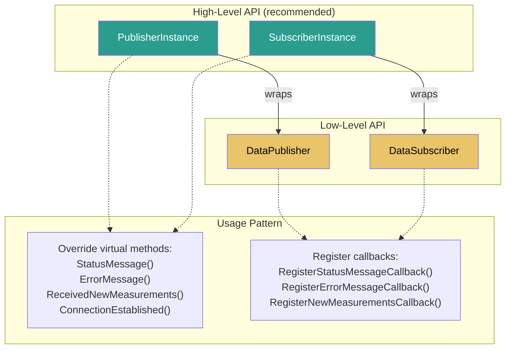
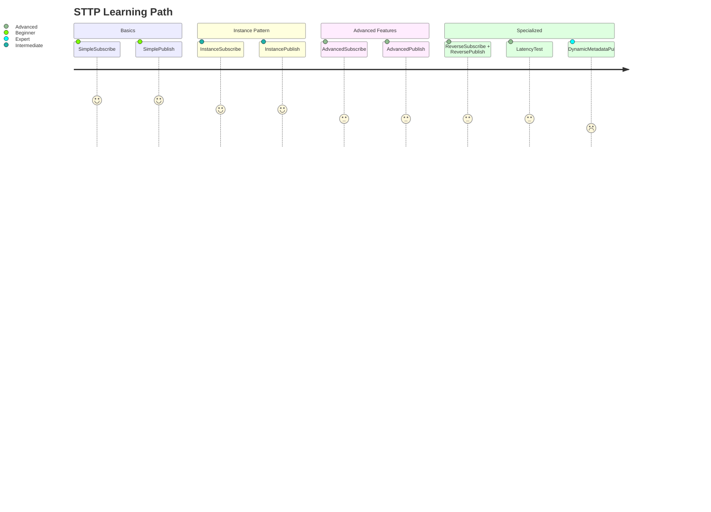
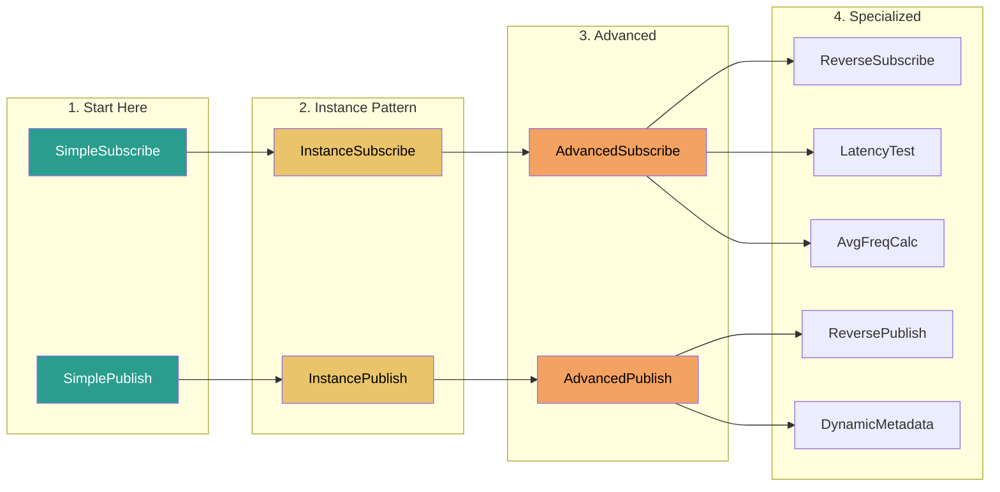
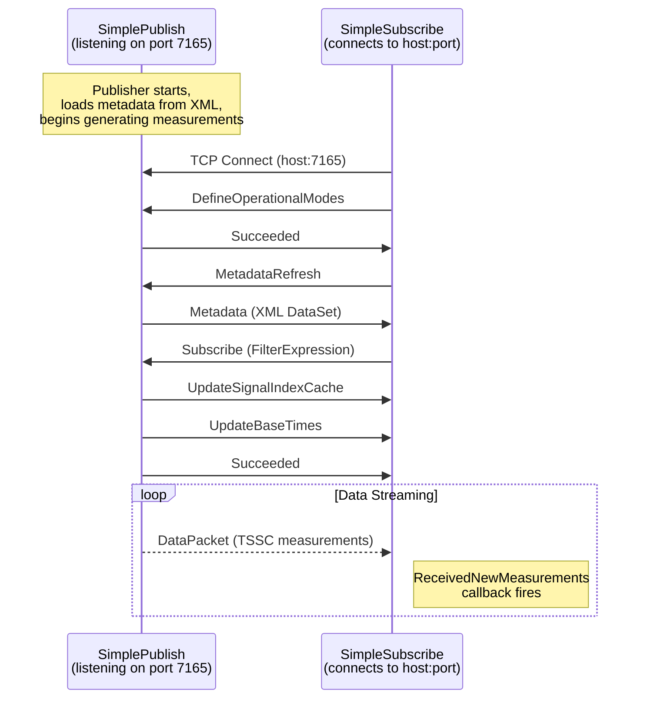
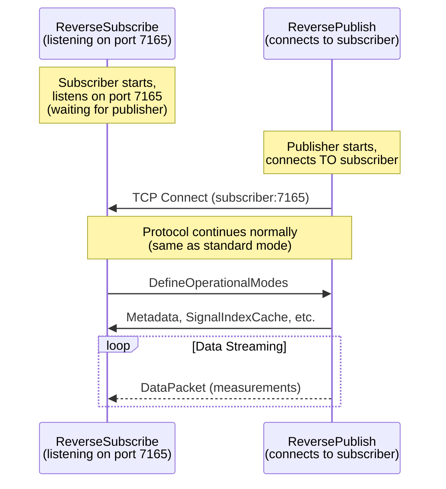
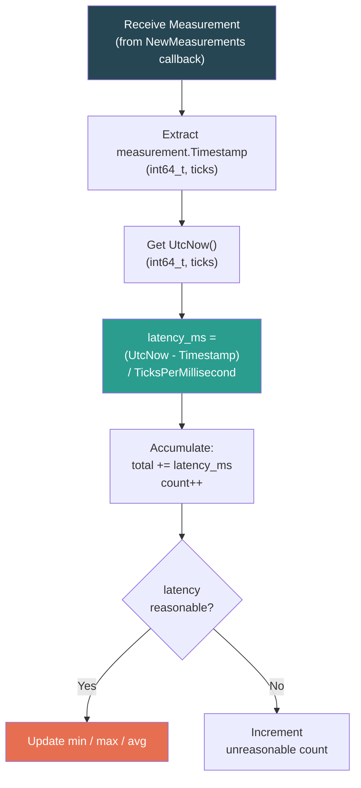

# STTP Sample Applications

> Guide to the 13 sample applications demonstrating STTP C++ API usage.

---

## Table of Contents

- [Overview](#overview)
- [Sample Matrix](#sample-matrix)
- [API Abstraction Layers](#api-abstraction-layers)
- [Learning Path](#learning-path)
- [Normal Connection Pattern](#normal-connection-pattern)
- [Reverse Connection Pattern](#reverse-connection-pattern)
- [Sample Details](#sample-details)

---

## Overview

The STTP C++ API includes 13 sample applications in `src/samples/`, organized by complexity and purpose. Each sample demonstrates specific aspects of the protocol, from basic pub/sub to advanced features like temporal subscriptions and latency measurement.

---

## Sample Matrix

| Sample | API Level | Role | Key Features |
|--------|-----------|------|-------------|
| **SimplePublish** | Low-level | Publisher | Basic measurement publishing, metadata from XML |
| **SimpleSubscribe** | Low-level | Subscriber | Basic subscription, new measurements callback |
| **InstancePublish** | High-level | Publisher | `PublisherInstance` base class, virtual method overrides |
| **InstanceSubscribe** | High-level | Subscriber | `SubscriberInstance` base class, auto metadata parsing |
| **AdvancedPublish** | High-level | Publisher | Dynamic metadata, temporal subscription support |
| **AdvancedSubscribe** | High-level | Subscriber | Auto-reconnect, metadata parsing, signal info display |
| **ReversePublish** | High-level | Publisher | Publisher connects to subscriber (firewall-friendly) |
| **ReverseSubscribe** | High-level | Subscriber | Subscriber listens, publisher initiates connection |
| **DynamicMetadataPublish** | High-level | Publisher | Runtime metadata updates, programmatic metadata creation |
| **LatencyTest** | High-level | Subscriber | Per-measurement latency calculation and statistics |
| **AverageFrequencyCalculator** | High-level | Subscriber | Signal processing, frequency averaging across devices |
| **FilterExpressionTests** | Utility | N/A | Filter expression parsing and evaluation tests |
| **InteropTest** | High-level | Subscriber | Cross-platform interoperability testing |

---

## API Abstraction Layers

The STTP C++ API provides two levels of abstraction:



| Level | Classes | Usage | Best For |
|-------|---------|-------|----------|
| **High-Level** | `PublisherInstance`, `SubscriberInstance` | Subclass and override virtual methods | Most applications |
| **Low-Level** | `DataPublisher`, `DataSubscriber` | Register function callbacks directly | Fine-grained control, integration |

---

## Learning Path

Recommended progression for learning the STTP API:





---

## Normal Connection Pattern

The standard pattern where the publisher listens and the subscriber connects:



**Run this pair:**
```bash
# Terminal 1 - Start publisher
./Output/SimplePublish 7165

# Terminal 2 - Connect subscriber
./Output/SimpleSubscribe localhost 7165
```

---

## Reverse Connection Pattern

The reverse pattern for firewall-friendly deployments:



**Run this pair:**
```bash
# Terminal 1 - Subscriber listens first
./Output/ReverseSubscribe 7165

# Terminal 2 - Publisher connects to subscriber
./Output/ReversePublish localhost 7165
```

---

## Sample Details

### SimplePublish / SimpleSubscribe

The minimal starting point. Demonstrates:
- Direct use of `DataPublisher` and `DataSubscriber` (low-level API)
- Registering callbacks with function pointers
- Loading metadata from XML
- Basic measurement generation and reception

**Key code patterns:**
```cpp
// Publisher: register callbacks and start
publisher.RegisterStatusMessageCallback(&StatusMessage);
publisher.Start(endpoints);
publisher.DefineMetadata(metadata);
publisher.PublishMeasurements(measurements);

// Subscriber: register callbacks and connect
subscriber.RegisterNewMeasurementsCallback(&NewMeasurements);
subscriber.Connect(hostname, port);
subscriber.Subscribe(info);
```

---

### InstancePublish / InstanceSubscribe

Demonstrates the **high-level API** using virtual method overrides:
- Subclass `PublisherInstance` or `SubscriberInstance`
- Override `StatusMessage()`, `ErrorMessage()`, `ReceivedNewMeasurements()`, etc.
- Simplified setup with automatic metadata handling

**Key code patterns:**
```cpp
class MySubscriber : public SubscriberInstance {
protected:
    void ReceivedNewMeasurements(const vector<MeasurementPtr>& measurements) override {
        // Process measurements here
    }
    void ConnectionEstablished() override { /* ... */ }
    void ConnectionTerminated() override { /* ... */ }
};
```

---

### AdvancedPublish / AdvancedSubscribe

Full-featured examples demonstrating:
- **AdvancedPublish**: Temporal subscription support, dynamic metadata from `DataSet`, timer-based measurement generation
- **AdvancedSubscribe**: Auto-reconnect via `SubscriberConnector`, metadata parsing (devices, measurements, phasors), signal information display

---

### ReversePublish / ReverseSubscribe

Demonstrates the reverse connection pattern:
- **ReverseSubscribe**: Calls `Listen(port)` instead of `Connect(host, port)`
- **ReversePublish**: Initiates TCP connection to the subscriber's listening port
- Identical protocol exchange after connection is established

---

### LatencyTest

Measures end-to-end message latency:



---

### AverageFrequencyCalculator

Subscribes to frequency measurements and computes rolling averages:
- Filters for frequency signals using `SignalType = 'FREQ'`
- Maintains per-device frequency accumulation
- Periodically reports average system frequency

---

### DynamicMetadataPublish

Demonstrates runtime metadata creation and updates:
- Builds `MeasurementMetadata` and `DeviceMetadata` programmatically
- Calls `DefineMetadata()` dynamically (not from static XML)
- Useful for data sources that discover their signals at runtime

---

### FilterExpressionTests

Test harness for the filter expression parser:
- Exercises various filter expression syntaxes
- Tests operators, functions, and type coercion
- Not a pub/sub application -- focuses on the `FilterExpressionParser` class directly

---

### InteropTest

Cross-platform interoperability testing:
- Connects to publishers from other STTP implementations (C#, Java, Go)
- Validates protocol compliance across languages
- Useful for verifying the C++ implementation against the reference implementation

---

## Building Samples

Build all samples at once:
```bash
make -j6 samples
```

Or build individually:
```bash
make SimplePublish
make SimpleSubscribe
make AdvancedPublish
make AdvancedSubscribe
make LatencyTest
# etc.
```

Sample binaries are output to the `Output/` directory.

---

*See also: [Architecture](Architecture.md) | [Protocol Reference](Protocol.md) | [TSSC Compression](TSSC.md) | [Filter Expressions](FilterExpressions.md) | [Build Instructions](../src/README.md)*
