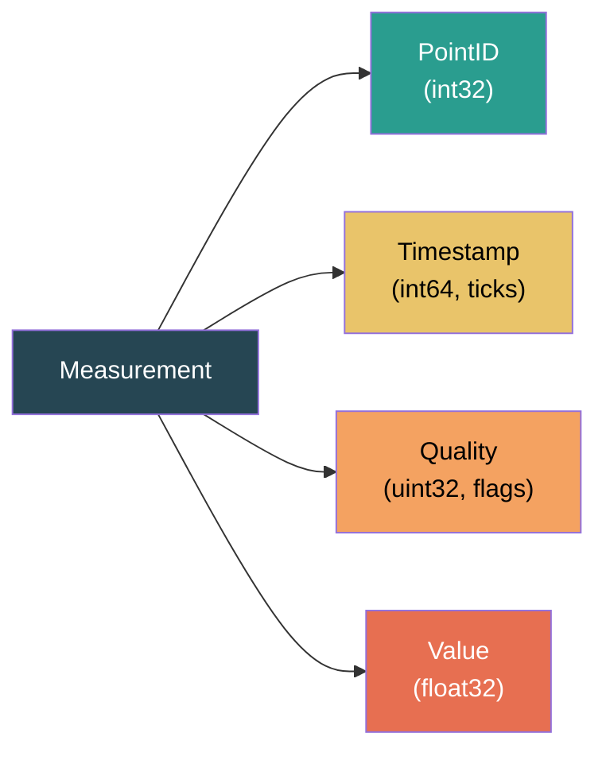
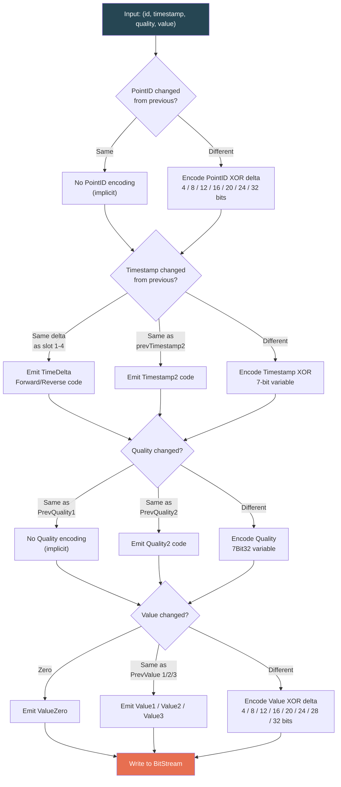
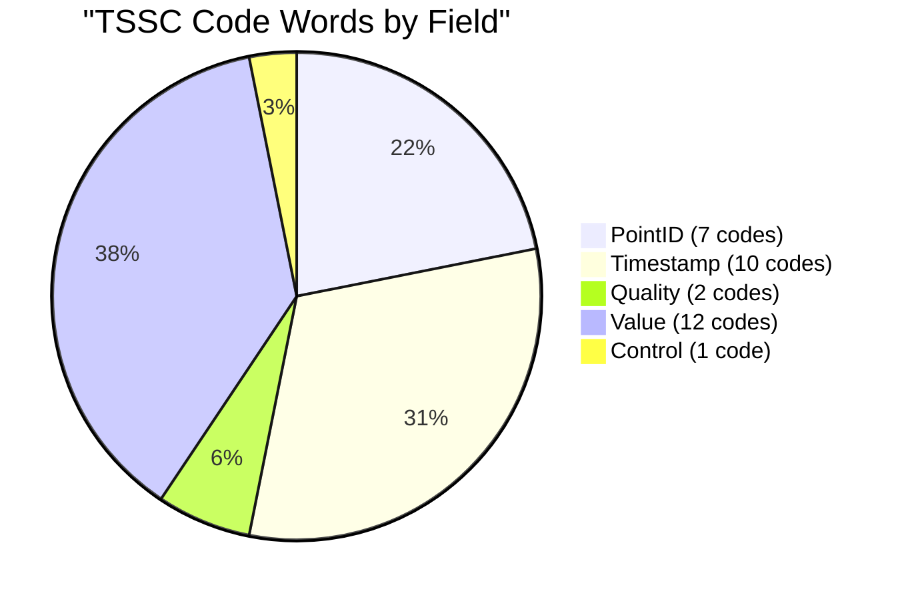
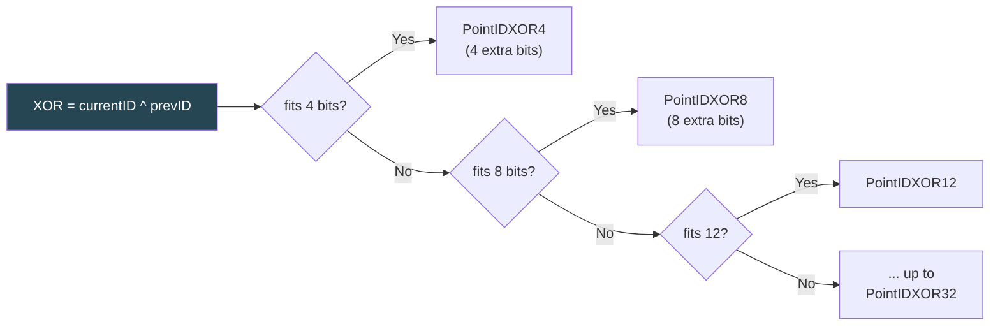
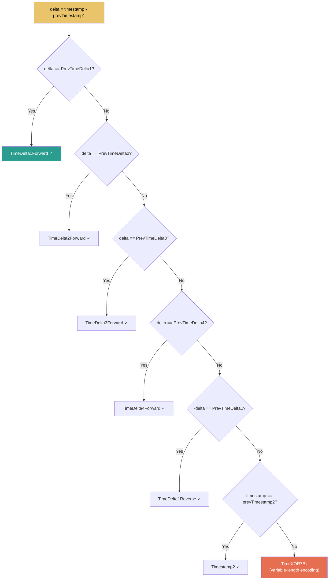
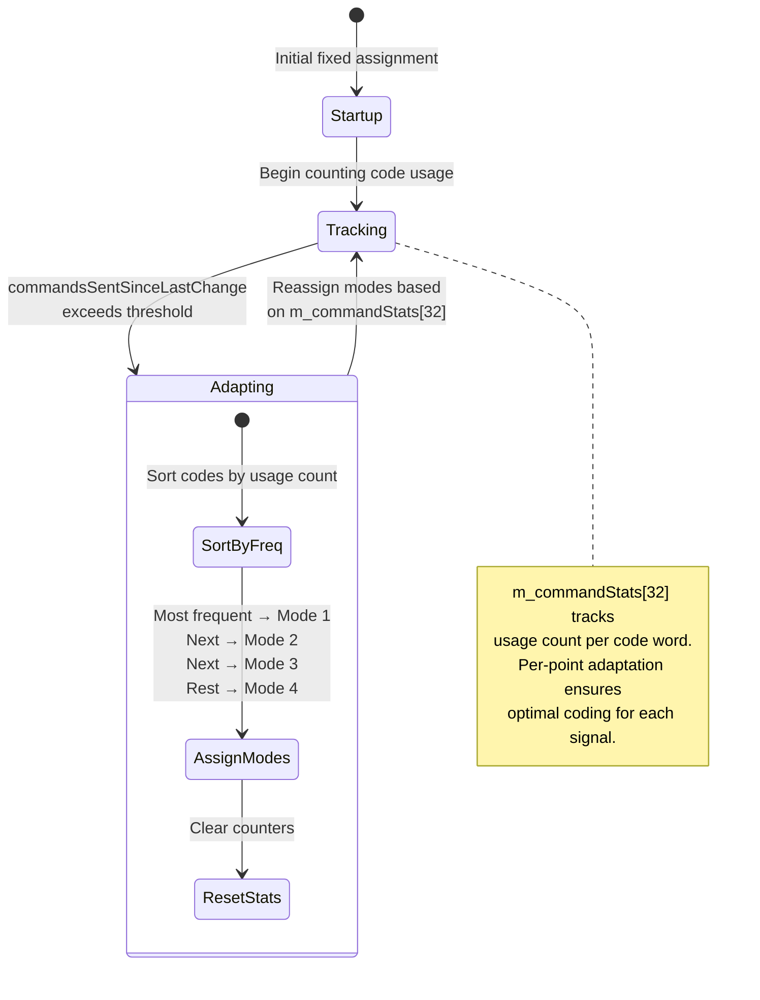
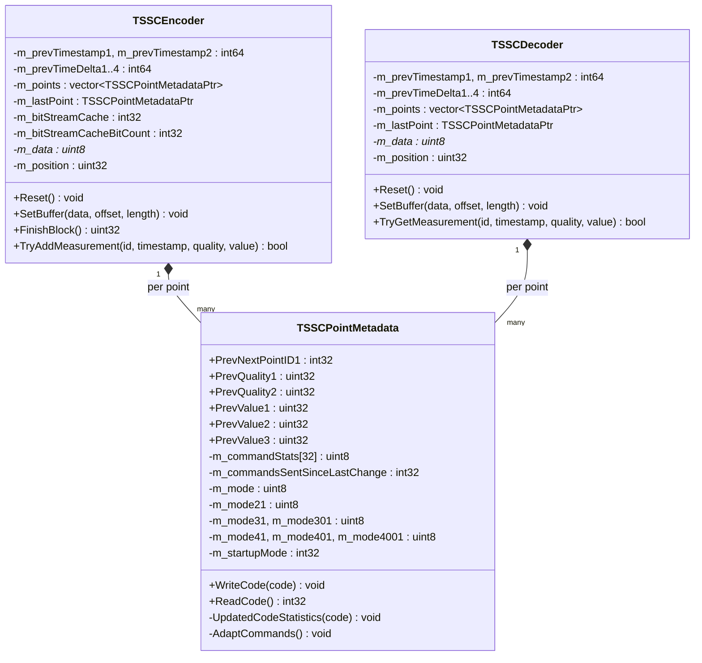
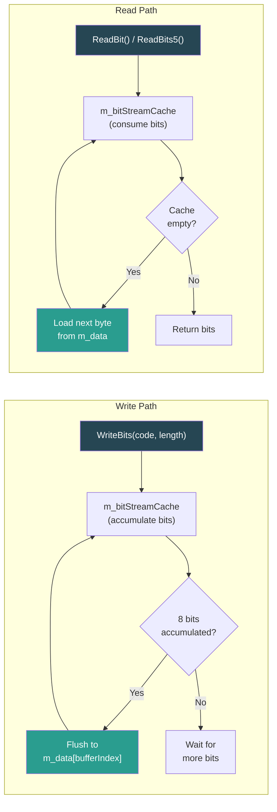
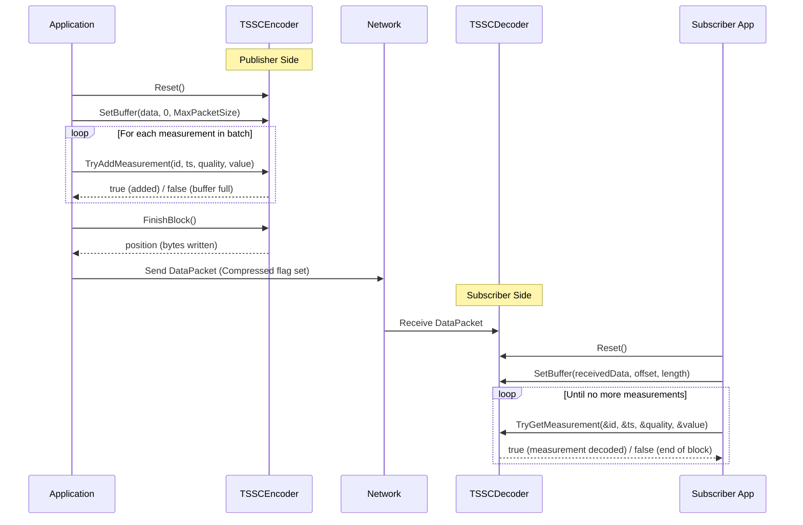
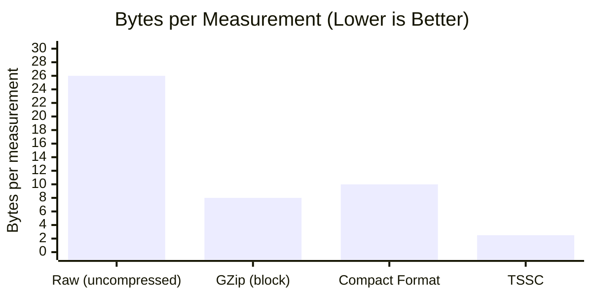

# Time-Series Special Compression (TSSC)

> Deep-dive into the TSSC algorithm used by STTP for efficient streaming telemetry compression.

---

## Table of Contents

- [Overview](#overview)
- [Why TSSC?](#why-tssc)
- [Measurement Encoding Pipeline](#measurement-encoding-pipeline)
- [TSSC Code Words](#tssc-code-words)
- [Delta Encoding Strategy](#delta-encoding-strategy)
- [Adaptive Prefix Coding](#adaptive-prefix-coding)
- [Per-Point Metadata State](#per-point-metadata-state)
- [Bit Stream Management](#bit-stream-management)
- [Encoder / Decoder Lifecycle](#encoder--decoder-lifecycle)
- [Compression Performance](#compression-performance)
- [Class Reference](#class-reference)

---

## Overview

**TSSC** (Time-Series Special Compression) is a delta-encoding algorithm with adaptive Huffman-like prefix codes, purpose-built for streaming telemetry data. It is the primary compression method in STTP for reducing bandwidth on the data channel.

Each measurement in STTP consists of four components:



TSSC exploits **temporal locality** in telemetry data: consecutive readings from the same sensor tend to have similar values, incrementing timestamps, and unchanged quality flags. By encoding only the *differences* from previous values, TSSC achieves significant compression ratios.

---

## Why TSSC?

| Feature | TSSC | GZip | Raw |
|---------|------|------|-----|
| **Designed for** | Streaming time-series | General-purpose | N/A |
| **Compression approach** | Per-field delta + adaptive coding | Dictionary + Huffman | None |
| **Latency** | Per-measurement (no buffering needed) | Block-based (needs buffer) | Zero |
| **State tracking** | Per-point history | Sliding window | None |
| **Typical ratio** | 10:1 to 20:1 | 3:1 to 5:1 | 1:1 |
| **CPU overhead** | Very low | Moderate | None |
| **Best for** | Steady-state telemetry streams | Metadata, bulk transfers | Testing |

TSSC outperforms generic compression because it understands the **structure** of time-series data:
- **Timestamps** are nearly monotonic with regular intervals
- **Values** change slowly (e.g., voltage = 119.98, 119.99, 120.01...)
- **Quality flags** rarely change during normal operation
- **Point IDs** follow predictable sequences in a data frame

---

## Measurement Encoding Pipeline

For each measurement, TSSC encodes the four fields in sequence, using delta-encoding against previous values:



---

## TSSC Code Words

TSSC defines **32 code words** (0-31), each representing a specific encoding scenario. The encoder selects the code word that requires the fewest bits for the current delta.

### Code Word Reference

| Code | Name | Field | Description |
|------|------|-------|-------------|
| 0 | `EndOfStream` | Control | Marks end of current TSSC block |
| 1 | `PointIDXOR4` | PointID | XOR delta fits in 4 bits |
| 2 | `PointIDXOR8` | PointID | XOR delta fits in 8 bits |
| 3 | `PointIDXOR12` | PointID | XOR delta fits in 12 bits |
| 4 | `PointIDXOR16` | PointID | XOR delta fits in 16 bits |
| 5 | `PointIDXOR20` | PointID | XOR delta fits in 20 bits |
| 6 | `PointIDXOR24` | PointID | XOR delta fits in 24 bits |
| 7 | `PointIDXOR32` | PointID | Full 32-bit XOR delta |
| 8 | `TimeDelta1Forward` | Timestamp | Same delta as slot 1, forward |
| 9 | `TimeDelta2Forward` | Timestamp | Same delta as slot 2, forward |
| 10 | `TimeDelta3Forward` | Timestamp | Same delta as slot 3, forward |
| 11 | `TimeDelta4Forward` | Timestamp | Same delta as slot 4, forward |
| 12 | `TimeDelta1Reverse` | Timestamp | Same delta as slot 1, reversed |
| 13 | `TimeDelta2Reverse` | Timestamp | Same delta as slot 2, reversed |
| 14 | `TimeDelta3Reverse` | Timestamp | Same delta as slot 3, reversed |
| 15 | `TimeDelta4Reverse` | Timestamp | Same delta as slot 4, reversed |
| 16 | `Timestamp2` | Timestamp | Same as previous timestamp 2 |
| 17 | `TimeXOR7Bit` | Timestamp | 7-bit variable-length XOR delta |
| 18 | `Quality2` | Quality | Same as previous quality 2 |
| 19 | `Quality7Bit32` | Quality | 7-bit variable-length encoding |
| 20 | `Value1` | Value | Same as previous value 1 |
| 21 | `Value2` | Value | Same as previous value 2 |
| 22 | `Value3` | Value | Same as previous value 3 |
| 23 | `ValueZero` | Value | Value is zero (0x00000000) |
| 24 | `ValueXOR4` | Value | XOR delta fits in 4 bits |
| 25 | `ValueXOR8` | Value | XOR delta fits in 8 bits |
| 26 | `ValueXOR12` | Value | XOR delta fits in 12 bits |
| 27 | `ValueXOR16` | Value | XOR delta fits in 16 bits |
| 28 | `ValueXOR20` | Value | XOR delta fits in 20 bits |
| 29 | `ValueXOR24` | Value | XOR delta fits in 24 bits |
| 30 | `ValueXOR28` | Value | XOR delta fits in 28 bits |
| 31 | `ValueXOR32` | Value | Full 32-bit XOR delta |

### Code Word Distribution by Field



---

## Delta Encoding Strategy

### PointID Delta

The point ID is XOR'd with the previous point ID. The result is encoded using the smallest bit-width that can represent it:



### Timestamp Delta

TSSC maintains a **4-slot history** of timestamp deltas (`PrevTimeDelta1..4`). If the current delta matches any slot, a compact 0-bit code is emitted:



For telemetry at a fixed sample rate (e.g., 30 samples/second), the timestamp delta is constant across all points in a frame, so `TimeDelta1Forward` is used almost exclusively -- requiring **zero extra bits**.

### Value Delta

Values are compared as raw 32-bit IEEE 754 floats using XOR. The bit-width of the XOR result determines the code word:

```
prevValue = 0x42F00000  (120.0)
currValue = 0x42F00148  (120.01)
XOR       = 0x00000148  → fits in 12 bits → ValueXOR12
```

When a measurement holds steady (common for status signals), the value is identical and no extra bits are needed (`Value1`).

---

## Adaptive Prefix Coding

TSSC uses **adaptive prefix codes** to assign shorter bit patterns to more frequent code words. This is similar in concept to Huffman coding but operates with a fixed set of 4 encoding modes.

### Encoding Modes

Each of the 32 code words is assigned one of 4 modes, determining its prefix bit pattern:

| Mode | Prefix | Total Bits | Description |
|------|--------|-----------|-------------|
| Mode 1 | *(none)* | 5 bits | Most frequent code -- no prefix, just 5-bit code |
| Mode 2 | `1` | 1 + 5 bits | Second most frequent -- 1-bit prefix |
| Mode 3 | `01` | 2 + 5 bits | Third tier -- 2-bit prefix |
| Mode 4 | `001` | 3 + 5 bits | Least frequent -- 3-bit prefix |

### Adaptive Mode Switching



The adaptation is **per-point**: each measurement point (`TSSCPointMetadata`) maintains its own command statistics and mode assignments. A voltage phasor that changes slowly will adapt differently from a rapidly varying frequency measurement.

### Mode Assignment Example

For a steady-state voltage measurement at 30 Hz:

| Code Word | Typical Frequency | Assigned Mode |
|-----------|-------------------|---------------|
| `TimeDelta1Forward` | ~100% of timestamps | Mode 1 (0 prefix bits) |
| `Value1` (same value) | ~80% of values | Mode 2 (1 prefix bit) |
| `ValueXOR4` | ~15% of values | Mode 3 (2 prefix bits) |
| `Quality7Bit32` | ~0.1% of quality | Mode 4 (3 prefix bits) |

---

## Per-Point Metadata State

Each unique point ID gets a `TSSCPointMetadata` instance that tracks encoding history:



**State tracking** enables the encoder to exploit patterns unique to each signal. For example:
- A frequency measurement at 60.000 Hz will often have `Value1` (unchanged)
- A voltage phasor angle cycling through 0-360 will use `ValueXOR8` or `ValueXOR12`
- Quality flags in normal operation will always match `PrevQuality1`

---

## Bit Stream Management

TSSC packs variable-length codes into a byte stream using a bit cache:



The bit stream is flushed at the end of each TSSC block via `BitStreamEnd()`, ensuring the final byte is properly padded.

---

## Encoder / Decoder Lifecycle



### Reset Behavior

Both encoder and decoder must be **reset** when:
- A new connection is established
- The signal index cache changes (`UpdateSignalIndexCache`)
- A TSSC synchronization error is detected

After reset, all per-point metadata is cleared, and delta encoding starts fresh.

---

## Compression Performance

### Typical Telemetry Characteristics

Synchrophasor data (PMU) at 30 samples/second exhibits strong patterns that TSSC exploits:

| Component | Typical Pattern | TSSC Efficiency |
|-----------|----------------|-----------------|
| **Timestamp** | Fixed 33.33ms interval | 0 extra bits (TimeDelta1Forward) |
| **Quality** | Always Normal (0x0) | 0 extra bits (implicit) |
| **Value (Frequency)** | ~60.000 Hz, changes < 0.01 | 4-8 extra bits (ValueXOR4/8) |
| **Value (Voltage)** | ~120.0V, steady | 0 extra bits (Value1) |
| **Value (Angle)** | Cycling 0-360 | 8-12 extra bits (ValueXOR8/12) |
| **PointID** | Sequential in frame | 4 extra bits (PointIDXOR4) |

### Compression Comparison



For a typical PMU data stream:
- **Raw**: ~26 bytes/measurement (16-byte GUID + 8-byte value + 8-byte timestamp + 4-byte quality)
- **Compact format**: ~10 bytes/measurement (4-byte index + 8-byte value + optional timestamp)
- **GZip on compact**: ~6-8 bytes/measurement (block compression)
- **TSSC**: **~2-3 bytes/measurement** (delta encoding + adaptive coding)

This translates to **10:1 or better** compression ratios for steady-state telemetry, dramatically reducing bandwidth requirements for large-scale deployments with thousands of measurements.

---

## Class Reference

### Source Files

| File | Path | Purpose |
|------|------|---------|
| `TSSCEncoder.h/cpp` | `src/lib/transport/tssc/` | Encodes measurements into TSSC format |
| `TSSCDecoder.h/cpp` | `src/lib/transport/tssc/` | Decodes TSSC-compressed measurements |
| `TSSCPointMetadata.h/cpp` | `src/lib/transport/tssc/` | Per-point state and adaptive coding logic |

### Key Methods

| Class | Method | Description |
|-------|--------|-------------|
| `TSSCEncoder` | `Reset()` | Clears all state for a fresh encoding session |
| `TSSCEncoder` | `SetBuffer(data, offset, length)` | Sets the output buffer for encoded data |
| `TSSCEncoder` | `TryAddMeasurement(id, ts, quality, value)` | Encodes one measurement; returns `false` if buffer is full |
| `TSSCEncoder` | `FinishBlock()` | Finalizes the current block; returns bytes written |
| `TSSCDecoder` | `Reset()` | Clears all state for a fresh decoding session |
| `TSSCDecoder` | `SetBuffer(data, offset, length)` | Sets the input buffer to decode from |
| `TSSCDecoder` | `TryGetMeasurement(&id, &ts, &quality, &value)` | Decodes one measurement; returns `false` at end of block |

---

*See also: [Architecture](Architecture.md) | [Protocol Reference](Protocol.md) | [Filter Expressions](FilterExpressions.md)*
