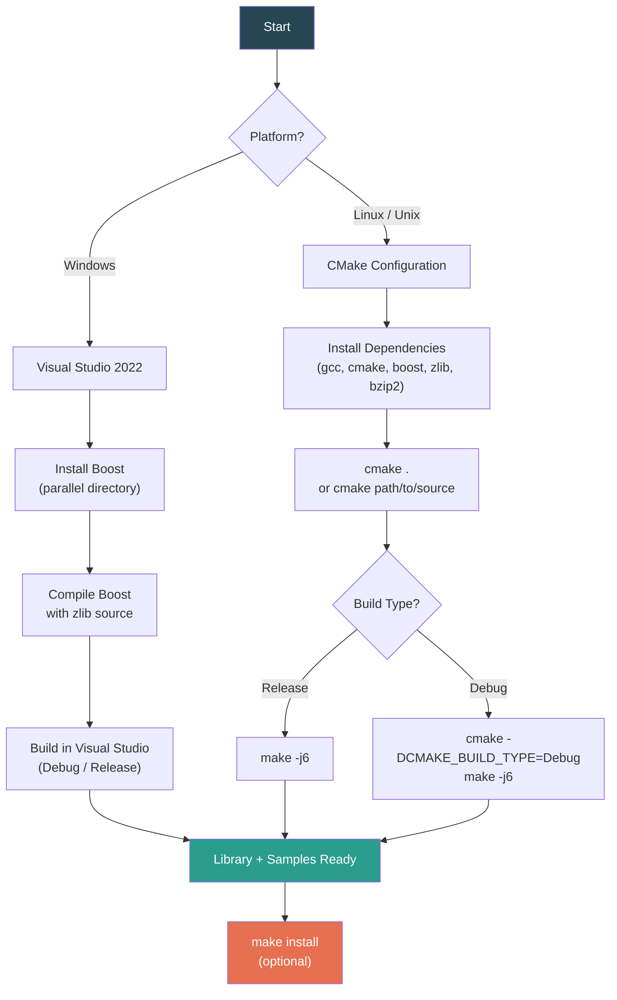
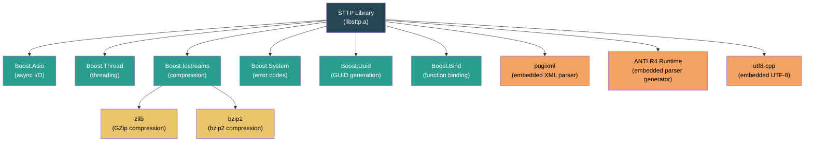
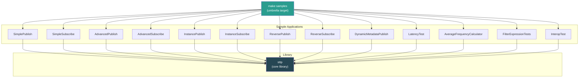

# Building the STTP C++ API

> Implementation of the Streaming Telemetry Transport Protocol (STTP) in C++.
> Code includes STTP functionality for both "subscribers" and "publishers".

---

## Table of Contents

- [Build Pipeline](#build-pipeline)
- [Dependency Graph](#dependency-graph)
- [Platform Support](#platform-support)
- [Compiling in Visual Studio](#compiling-in-visual-studio)
- [Compiling in Linux](#compiling-in-linux)
- [Build Targets](#build-targets)

---

## Build Pipeline



---

## Dependency Graph



> **Embedded** dependencies (pugixml, ANTLR4 runtime, utf8-cpp) are included in the source tree and require no separate installation.

---

## Platform Support

| Platform | Compiler | Boost Versions | Build System | Standard |
|----------|----------|----------------|--------------|----------|
| Windows | Visual Studio 2022 | 1.66, 1.71, 1.74, 1.75, 1.80 | VS Solution | C++20 |
| Linux (Ubuntu) | gcc 10.2+ | 1.80.0 | CMake 2.8+ | C++20 |
| Unix variants | gcc 10.2+ | 1.80.0 | CMake 2.8+ | C++20 |

---

## Compiling in Visual Studio

To properly compile in Visual Studio, you will need to download Boost:
    http://www.boost.org/users/download/

By default, the C++ STTP API project configuration adds an additional include
directory for the Boost libraries in a parallel location to the API project in
a folder called _boost_ regardless of version, for example:

STTP API project files:
```
    C:\projects\sttp\cppapi
                     \src
                     \build
                     etc...
```
Boost library files:
```
    C:\projects\sttp\boost
                     \doc
                     \libs
                     etc...
```

If you have an existing Boost installation you can simply create a symbolic
link to the folder, e.g.:
```cmd
mklink /D C:\projects\sttp\boost C:\boost_1_80_0
```

Alternately you can adjust the additional include directories to your own
Boost installation location for each of the build configurations. The code
has been tested with v1.66, v1.71, v1.74, v1.75 and v1.80 of Boost.

Note that you will need to compile Boost in order to execute the sample
applications found in:
```cmd
sttp\cppapi\src\samples
```

The STTP API library requires the zlib features of Boost, as a result it is necessary
to compile boost with access to zlib source code that can be downloaded separately:
https://zlib.net/

After unzipping the zlib source code and running the Boost `bootstrap.bat` script,
run  the `.\b2` build application with the following zlib parameters, adjusting
the paths to the directory where the zlib source code was unzipped:
```cmd
b2 -s ZLIB_SOURCE="C:\zlib-1.2.13" -s ZLIB_INCLUDE="C:\zlib-1.2.13"
```

## Compiling in Linux

The following information is intended to help developers build the STTP API
library on Linux platforms. Similar instructions may apply to other platforms.

### Dependencies

The STTP API library depends on the following libraries in order to build.
Earlier versions of the libraries listed may not work properly.

* CMake v2.8 (http://www.cmake.org/)

* GNU Make (http://www.gnu.org/software/make/)

* gcc v10.2 (for C++20 support)

* zlib Library, e.g.: `sudo apt install zlib1g-dev`

* bzip2 Library, e.g.: `sudo apt install libbz2-dev`

* Boost C++ Libraries v1.80.0 (http://www.boost.org/)
    - Boost.Asio
    - Boost.Bind
    - Boost.Iostreams
    - Boost.System
    - Boost.Thread
    - Boost.Uuid

Boost will need to be compiled:
https://www.boost.org/doc/libs/1_80_0/more/getting_started/unix-variants.html

For Ubuntu, here are some common steps:

```bash
sudo apt update
sudo apt install build-essential
sudo apt install cmake
sudo apt install gcc-10 g++-10
sudo update-alternatives --install /usr/bin/gcc gcc /usr/bin/gcc-10 100 --slave /usr/bin/g++ g++ /usr/bin/g++-10 --slave /usr/bin/gcov gcov /usr/bin/gcov-10

sudo apt install zlib1g-dev
sudo apt install libbz2-dev

sudo mkdir /usr/local/boost_1_80_0
cd /usr/local/
sudo wget https://boostorg.jfrog.io/artifactory/main/release/1.80.0/source/boost_1_80_0.tar.bz2
sudo tar -xvjf boost_1_80_0.tar.bz2
```

Start a new terminal session before building Boost:

```bash
cd /usr/local/boost_1_80_0
sudo ./bootstrap.sh
sudo ./b2 install
```

It may be necessary to add `/usr/local/lib`, the default path for boost libraries,
to the system library path before running any samples:

```bash
sudo ldconfig /usr/local/lib
```

### Configuration

From the command terminal, enter the source directory containing this
README file and type the following command:

```bash
cmake .
```

Alternatively, you can create a build directory separate from the
source code you downloaded. Enter the build directory you created
and type the following command:

```bash
cmake path/to/source
```

Using the CMake GUI, you can modify configuration options, such as
building as a shared library or changing the installation directory.

To make a debug build, use the following:

```bash
cmake -DCMAKE_BUILD_TYPE=Debug -DCMAKE_CXX_FLAGS="-Wno-unknown-pragmas"
```

### Build

At the top level of the build directory, type the following command.

```bash
make -j6
```

In addition to the library itself, there are sample applications which
demonstrate the proper use of the STTP library API. To build all samples,
type the following command:

```bash
make -j6 samples
```
> Hint: You can start with samples and this will auto-build STTP library dependency.

### Installation

At the top level of the build directory, type the following command.

```bash
make install
```

This will move the header files and the library file to the location
specified during configuration. Header files go under the 'include/'
subdirectory, and the library file goes under the 'lib/' subdirectory.

---

## Build Targets



### Quick Reference

| Command | Description |
|---------|-------------|
| `cmake .` | Configure build (from source directory) |
| `cmake -DCMAKE_BUILD_TYPE=Debug .` | Configure debug build |
| `make -j6` | Build core library |
| `make -j6 samples` | Build all samples (auto-builds library) |
| `make SimpleSubscribe` | Build a single sample |
| `make install` | Install headers and library |

Individual sample applications can be built as follows:

```bash
make AdvancedPublish
make AdvancedSubscribe
make AverageFrequencyCalculator
make DynamicMetadataPublish
make FilterExpressionTests
make InstancePublish
make InstanceSubscribe
make InteropTest
make LatencyTest
make ReversePublish
make ReverseSubscribe
make SimpleSubscribe
make SimplePublish
```

---

*See also: [Architecture](../doc/Architecture.md) | [Sample Applications](../doc/Samples.md) | [Project README](../README.md)*
