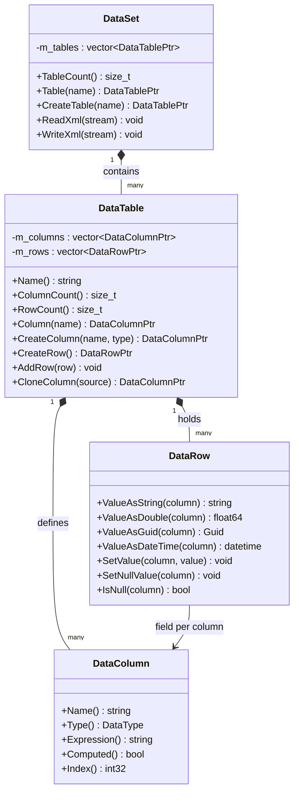
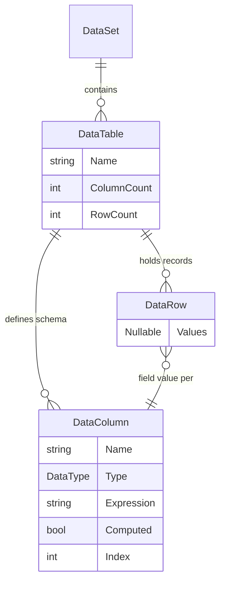
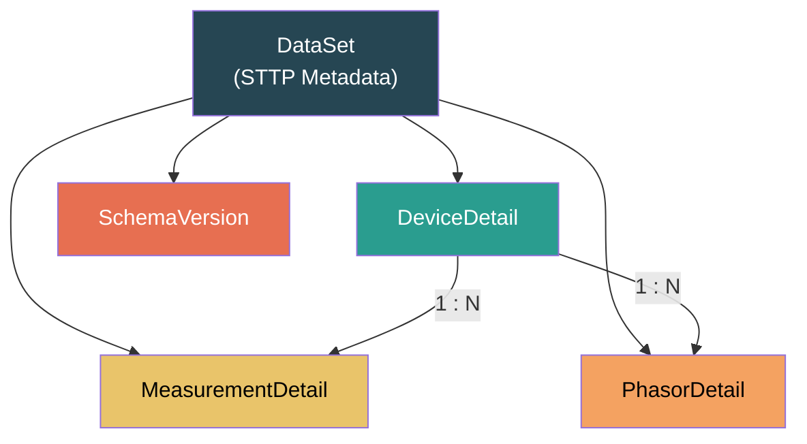
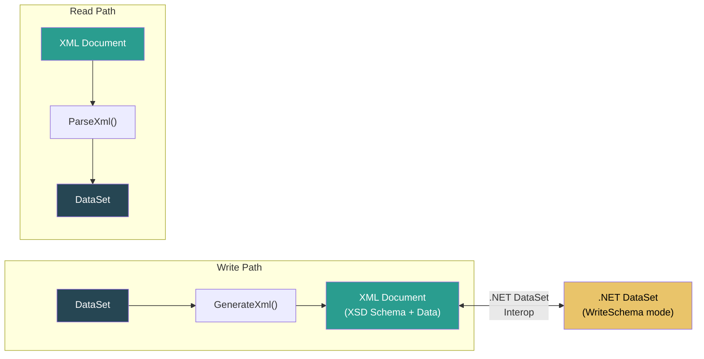

# STTP Data Sets

> In-memory tabular data structures for metadata storage, serialization, and querying.

---

## Overview

A [DataSet](https://github.com/sttp/cppapi/blob/master/src/lib/data/DataSet.h) represents an in-memory cache of records that is structured similarly to information defined in a database. The data set object consists of a collection of [DataTable](https://github.com/sttp/cppapi/blob/master/src/lib/data/DataTable.h) objects.

Data tables define a collection of [DataColumns](https://github.com/sttp/cppapi/blob/master/src/lib/data/DataColumn.h#L60) where each data column defines a name and [data type](https://github.com/sttp/cppapi/blob/master/src/lib/data/DataColumn.h#L32). Data columns can also be computed where its value would be derived from other columns and [functions](https://github.com/sttp/cppapi/blob/master/doc/FilterExpressions.md#functions) defined in an expression.

Data tables also define a set of [DataRows](https://github.com/sttp/cppapi/blob/master/src/lib/data/DataRow.h) where each data row defines a record of information with a field value for each defined data column. Each field value can be `null` regardless of the defined data column type.

---

## Class Hierarchy

---

## Entity Relationships

---

## Data Types

The `DataType` enum defines the supported column types:

| DataType | C++ Type | Description |
|----------|----------|-------------|
| `String` | `std::string` | Text data |
| `Boolean` | `bool` | True/false |
| `DateTime` | `datetime_t` | Date and time |
| `Single` | `float32_t` | 32-bit float |
| `Double` | `float64_t` | 64-bit float |
| `Decimal` | `decimal_t` | High-precision decimal |
| `Guid` | `Guid` | 128-bit unique identifier |
| `Int8` | `int8_t` | Signed 8-bit integer |
| `Int16` | `int16_t` | Signed 16-bit integer |
| `Int32` | `int32_t` | Signed 32-bit integer |
| `Int64` | `int64_t` | Signed 64-bit integer |
| `UInt8` | `uint8_t` | Unsigned 8-bit integer |
| `UInt16` | `uint16_t` | Unsigned 16-bit integer |
| `UInt32` | `uint32_t` | Unsigned 32-bit integer |
| `UInt64` | `uint64_t` | Unsigned 64-bit integer |

---

## STTP Metadata Tables

When used with STTP, the DataSet contains standard metadata tables:

| Table | Key Fields | Description |
|-------|-----------|-------------|
| **DeviceDetail** | UniqueID, Acronym, Name, FramesPerSecond | Physical device metadata |
| **MeasurementDetail** | SignalID, PointTag, SignalReference, Description | Per-signal metadata |
| **PhasorDetail** | DeviceAcronym, Label, Type, Phase, SourceIndex | Phasor channel definitions |
| **SchemaVersion** | VersionNumber | Metadata schema version |

---

## XML Serialization

A data set schema and associated records can be read from and written to XML documents using the W3C XML Schema Definition Language (XSD) standard.

See the [ReadXml and WriteXml](https://github.com/sttp/cppapi/blob/master/src/lib/data/DataSet.h#L80) functions.

---

## Interoperability

> The STTP data set functionality is modeled after, and generally interoperable with, the [.NET DataSet](https://docs.microsoft.com/en-us/dotnet/api/system.data.dataset). Serialized XML schemas and data saved from a .NET DataSet can be successfully parsed from an STTP data set and vice versa.

**Key differences from .NET:**
- STTP **requires** the schema to be included with serialized XML (equivalent to [XmlWriteMode.WriteSchema](https://docs.microsoft.com/en-us/dotnet/api/system.data.xmlwritemode))
- STTP defines **more functions** than the .NET implementation for [column expressions](https://docs.microsoft.com/en-us/dotnet/api/system.data.datacolumn.expression) (see [Filter Expressions](https://github.com/sttp/cppapi/blob/master/doc/FilterExpressions.md#functions))
- STTP is always **case-insensitive** for table and column name lookups
- Primary use-case is [filter expressions](https://github.com/sttp/cppapi/blob/master/doc/FilterExpressions.md) for signal selection

---

## Source Files

| File | Description |
|------|-------------|
| [`DataSet.h`](DataSet.h) | DataSet container class |
| [`DataTable.h`](DataTable.h) | Table definition with columns and rows |
| [`DataColumn.h`](DataColumn.h) | Column definition with name, type, and optional expression |
| [`DataRow.h`](DataRow.h) | Row record with typed field access and null support |

---

*See also: [Filter Expressions](../../doc/FilterExpressions.md) | [Architecture](../../doc/Architecture.md) | [Protocol Reference](../../doc/Protocol.md)*
